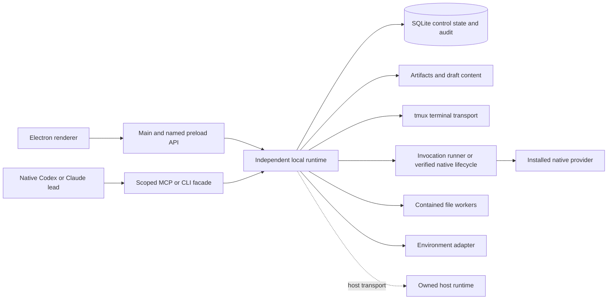
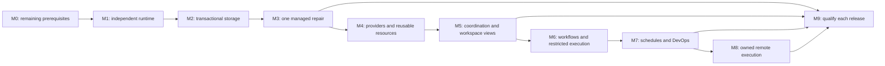

# MINIMAL — implementation roadmap from v1.2.1 to the FUTURE system

Execution revision 3 · 2026-09-14 · Baseline commit `3d96f78` · **M0 complete as v1.2.2; M1 in progress on `feat/m1-runtime`.**

Start with the existing terminal application. Establish independent runtime ownership and transactional state, then complete one managed repair with trustworthy review evidence. Extend that same execution path into reusable capabilities, coordinated work, workflows, schedules and owned remote hosts. Keep ordinary terminals available throughout.

This is the implementation entry point. It reconciles all 20 supplied FUTURE files with the actual v1.2.1 source. The [original README](README.md) preserves product intent, [specification](SPECIFICATION.md) supplies design sketches, [architecture](docs/ARCHITECTURE.md) develops failure contracts, and [research index](docs/RESEARCH.md) preserves evidence. Use this roadmap's sequencing and corrections where those proposals conflict. Current owner instructions take precedence; shipped behavior is established by code and verification, not a planning checkbox.

Read [the starting position](#starting-position), [design corrections](#design-corrections), and the milestone immediately ahead. Consult relevant research through the [coverage map](#coverage-map). Do not require a future implementer to reread the complete research archive for every increment.

## Destination and release boundaries

The complete planned system lets a user or a scoped native Codex/Claude lead prepare work, select context and capabilities, execute in an appropriate environment, coordinate independent tasks, inspect exact-result evidence, and deliberately accept or publish results. Successful routines become immutable recipes and schedules. A registered Linux host can own execution when the desktop is unavailable.

MINIMAL owns deterministic management and recovery. The installed providers own reasoning, their tool loops and native conversation state. Keep Electron/React/TypeScript, xterm, tmux and the contained Python file provider. Add one local runtime, one SQLite implementation, and narrow adapters as their milestones require them.

| Release checkpoint | Required milestones | What the user can rely on |
| --- | --- | --- |
| Runtime foundation | M0–M2 | Existing terminal/file workflow backed by an independently runnable owner and recoverable transactional storage |
| First managed pilot | M3 | One supported provider completes prepare → execute → verify → review → accept; GUI recovery never resends the task |
| Full local managed workspace | M4–M6 | Both supported managed providers, reusable resources/configuration, a scoped lead, isolated parallel work, split terminals and rehearsable workflows |
| Local automation | M7 | Durable schedules, honest time/usage history and scoped CI/DevOps operations |
| Complete planned execution scope | M8 plus M9 technical qualification | Local, verified restricted-local and owned-remote execution using the same management contracts |
| First paid local offer | M9 commercial gate after a useful local checkpoint | A separately validated business decision; remote hosting, team support and billing infrastructure are not dependencies of the local pilot |

These are capability checkpoints, not promised version numbers or dates. Assign semver when an increment's compatibility impact is known. Public marketplace, hosted multi-tenancy, native Windows/macOS, collaborative editing, automatic provider substitution, autonomous production deployment, custom model orchestration frameworks and mandatory vector retrieval remain separate expansion decisions.

## Starting position

The inspected application is **1.2.1**, with JSON state schema **2**, file-worker protocol **2**, and settings schema **1**. These version numbers describe different contracts. Resolved dependencies include Electron 44.2.0, React 19.2.8, TypeScript 7.0.2, Vite 8.2.2, xterm 6.0.0 and Zod 4.5.4. Linux/WSL is the current support boundary.

The [baseline snapshot](../docs/build-snapshot-v1.2.1.md) and [verification record](../docs/verification.md) report 73 backend and 89 desktop cases, build, package and packaged smoke passing on 2026-09-13. That baseline was reproduced before M0 implementation: 73 backend and 89 desktop cases, typecheck/build and packaged smoke passed in isolated profiles. The table below remains a historical starting position; current progress and new evidence follow in M0 and the verification record.

| Area | Actual foundation | Remaining work and owner |
| --- | --- | --- |
| Sessions and terminals | Independent UUIDs, custom commands/presets, batch 1–32, add/remove/reconnect, retained exit state; 128 records/session | Preserve this workflow; M1 changes ownership, M5 adds simultaneous views |
| Services and engine | `SessionService` facade; separate state, launch, stop and reconciliation modules; real `EngineAdapter` | Extract these incrementally into the runtime, not a replacement god-service (M1–M2) |
| Persistence | Ordered durable JSON writes, recovery backups, persisted bounded events | State and event journal are separate commits; unknown-schema fallback opens a backed-up empty workspace. Add upgrade refusal before transactional migration (M0–M2) |
| File safety | Expected-hash conflict review, drafts with `baseHash`, contained operations, typed responses, queue/deadline limits | Add draft revisions/root identity, managed writer coordination, recoverable destructive changes and fairness across projects (M2–M3/M6) |
| Listing/preview | Paged directory iteration, virtual rows, header-first preview | Retain and extend meaningful boundary tests; do not rebuild these from the v1.1 gap list |
| Terminal transport | UTF-8 byte accounting, acknowledged input, bounded queues, correct bracketed paste | One global attachment; unsent input cancels on disposal. Future accepted-paste continuity is an explicit behavior change (M1/M5) |
| UI and settings | Working terminal/explorer UI; settings file; stored env profiles, metadata and hook definitions | No settings/profile management UI, executable hooks, task inbox or command palette. `App.tsx` is 838 lines (M1/M3–M5) |
| Integration boundary | Named preload API, validated file-worker envelopes, isolated renderer | Electron handler wrapper still uses `any`; no complete request/response manifest, handshake or renderer domain-event subscription (M1–M2) |
| Distribution and CI | Git history; backend, desktop and package CI jobs | Release directory is reused. Backend glob only includes top-level tests; Playwright enumerates six filenames. New nested tests would be missed unless discovery changes (M0) |

Source starting points: [main composition](../src/main/index.ts), [service facade](../src/main/service.ts), [state](../src/main/workspace-state.ts), [store](../src/main/store.ts), [event bus](../src/main/event-bus.ts), [file service](../src/main/filesystem.ts), [profile identity](../src/main/profile-runtime.ts), [preload](../src/preload/index.ts), [renderer synchronization](../src/renderer/useWorkspace.ts), [package script](../scripts/package.mjs), [test configuration](../playwright.config.ts).

## Design corrections

The specialist reviews contain useful failure contracts. Their agreement does not establish that later specification examples implement those contracts. Apply these corrections before copying code or tests from the specification.

| Conflicting or over-specific proposal | Roadmap decision and reason |
| --- | --- |
| Specification §3 P0 reproduces v1.1 and forbids source repairs | Use v1.2.1; carry forward existing passing behavior and repair only remaining prerequisites. No redundant drift report: record evidence in the existing verification document. |
| §3 P1 allows the runtime to remain inside `SessionService`; §13 requires independent supervision | The production runtime is a separate process. Extract behind the existing UI facade first; migrate storage separately. Compare native provider supervision before adding another wrapper. |
| §13 R-2 implies each runner owns a tmux server | Separate service/process lifetime, not one server per invocation. Reuse a private execution backend where it passes cold-start and runtime-service restart tests. Preserve existing live servers; do not restart them to satisfy a layout refactor. |
| §3 P1 recommends a SQLite binding because it survives OneDrive better | Remove this unsupported rationale. Bindings cannot repair filesystem semantics. Active control storage belongs on supported Linux-native storage; project files may remain on Windows mounts. Select a patched shipped engine/runtime together. |
| §3 P1 expects lock contention after `kill -9`; §3 P3 transfers leases after heartbeat expiry | An OS lock is released when its last owning descriptor closes. Prevent descriptor inheritance; reacquire and reconcile after owner death. Keep the lock inode stable. A missed heartbeat cannot prove a surviving writer stopped. [Linux flock](https://man7.org/linux/man-pages/man2/flock.2.html) |
| §3 P1 imports everything into one `v2_legacy.payload` and leaves events unchanged | Preserve raw inputs as migration evidence, then use entity rows and short transactions. State, audit event, ingestion cursor and dispatch intent must commit together when related. No permanent whole-state JSON blob or dual writes. |
| Schema markers/read-only legacy JSON are assumed to stop every old binary | v1.2.1 backs up unknown schemas and permits empty-state writes. Introduce a refusal-capable compatibility release and test actual older packages. Same-user historical binaries cannot be retroactively forced to honor a new lock; explicitly bound supported upgrade paths. |
| §3 sketches separate Attempt and Run, optional local host, zero-default usage, and incompatible status enums | A Run is one attempt; Invocation is one concrete provider start. Add retry and continuation links separately. Assign a local host ID immediately. Unknown usage stays nullable with provenance. Use one transition vocabulary (below). |
| `request<T>(method: string)` and renderer-controlled arbitrary `transitionTask` | A shared method manifest defines validated requests, responses and events. Expose semantic commands such as start, cancel and accept; the runtime computes legal transitions and authoritative digests. |
| §4.2 fixes Codex first, assumes Claude flags/approval mechanics; §3 renders structured runs through xterm | Choose the first provider by a bounded compatibility trial. Render normalized events as escaped structured content; xterm remains the human terminal. Add live steering only when the chosen native interface supports it. |
| §4.4 rejects identical blobs with different provenance; §3 uses broad `data:` artifact previews | Deduplicate immutable bytes; store provenance and scoped access in separate references. Safely render text/diffs and allowlisted image types; do not execute HTML/SVG or trust a provider-supplied file path. |
| §4.3 treats revocation as retroactive; §13 assumes grants govern arbitrary native shell actions | Recheck authority at mediated execution boundaries, block new work after revocation, and report started effects honestly. A trusted same-user shell can bypass application policy. Enforced restrictions require a tested provider/OS boundary. |
| §3 P3 scans only `.git/hooks`; extends the Hook type into a universal catalog | Resolve effective Git configuration, including `core.hooksPath` and shared repository paths. Use a distinct capability-kind union and installers; a hook is one kind. [Git hooks](https://git-scm.com/docs/githooks) |
| Multiple recipe runners, audit sinks, notice systems, glossary/drift documents and a 22-day table | One workflow executor, one domain audit store, one attention model and this checklist. Keep operational NDJSON separate. Use evidence gates rather than unsupported calendar estimates; add documents only for decisions that need them. |
| §13.3 describes “12-week” commercial thresholds and binds paid release to all phases | The actual commercial note proposes four-/six-week cohorts with different thresholds. Treat them as optional experiments, not technical acceptance criteria. A local release does not wait for remote or team commercialization. |

Current documentation checked on 2026-09-13 still supports structured Codex JSONL jobs, while app-server documentation retains a production-support caveat. Keep rich integration capability-gated. [Codex non-interactive mode](https://learn.chatgpt.com/docs/non-interactive-mode), [app-server](https://learn.chatgpt.com/docs/app-server).

Claude's documented print-mode configuration discovery and bare-mode authentication differ; do not silently switch a subscription user into API authentication to simplify setup. Validate the selected mode and permission interface against its installed version. [Programmatic Claude Code](https://code.claude.com/docs/en/headless), [CLI reference](https://code.claude.com/docs/en/cli-reference).

SQLite documents the WAL-reset fix in 3.51.3 and selected backports; inspect the bundled engine, not merely the npm version. The current Node documentation labels `node:sqlite` release-candidate; neither that latest page nor the project's Node 22.12 minimum selects the shipped driver. [SQLite WAL](https://sqlite.org/wal.html), [Node SQLite](https://nodejs.org/api/sqlite.html).

These targeted checks do not revalidate every competitive claim, provider account entitlement or commercial term in the research archive. Recheck the relevant primary documentation when its integration gate is reached.

## Architecture to grow toward

Only the runtime writes domain state. Its bounded database worker owns the connection; runners own pipes, receipts and transport spools, not a second task database. Provider events, terminal bytes, operational logs and committed domain facts are separate streams with separate budgets. Each host owns its own database; remote support is not database replication.

Evolve toward `src/shared/` contracts, `src/main/` desktop integration, `src/runtime/` domain/persistence/execution/providers/context/capabilities/policy/workspaces, and `src/runner/` transport ownership. Reuse existing modules before moving them. Do not create empty future directories or another language runtime for artifact hashing without a concrete need.

| Identity | Meaning |
| --- | --- |
| Profile / host | Stable application ownership and execution location; distinct from paths and runtime generations |
| Project / workspace | Existing session's project identity / a concrete execution root with its own write ownership |
| Task / run | Desired outcome / one attempt at it; a retry creates a new run with `retryOfRunId` |
| Invocation | Actual provider start; continuation records `continuationOfInvocationId` and a documented provider reference |
| Workflow run / step | One recipe execution / one durable operation; agent steps reference managed runs rather than inventing another agent lifecycle |
| Terminal / attachment | Persistent command resource / disposable view with explicit input and resize ownership |
| Artifact / receipt | Immutable result bytes / provenance, scope and verification observations bound to those bytes |
| Grant / attention item | Authorized action or scope / a pending human decision or review; reading an item is not authority |

Use task states `draft → ready → in_progress → review → accepted`, with `blocked` and `cancelled` branches. Runs use `queued, preparing, running, waiting_for_input, verifying, completed, failed, cancelling, cancelled, interrupted, unknown`. Process state and connectivity remain separate observations. Finishing a provider invocation does not accept a task. Future schemas must enforce allowed transitions, revisions and relationships rather than copying the specification's inconsistent examples.

## Milestone sequence

M9 is a recurring release gate. Each milestone below is divided into small, integrated changes; finishing backend modules alone does not pass its exit gate. Check boxes only when the integrated behavior and its evidence exist. Runtime experiments and provider discovery do not count as shipped managed execution.

### M0 — establish the remaining prerequisites

**Entry:** the v1.2.1 baseline and preserved user workspace. **Why first:** new processes and schemas make packaging, test discovery and upgrade mistakes much harder to recover from.

- [x] M0.1 Record the starting commit, resolved runtime/dependency versions, current schema files and private tmux namespace. Reproduce the existing checks in isolated profiles when implementation begins; preserve their evidence in `docs/verification.md`.
- [x] M0.2 Extend backend and desktop discovery before adding nested tests. Have CI list discovered cases and demonstrate that a newly added nested regression runs. Retain the Python and real-tmux coverage; do not confuse compilation with execution.
- [x] M0.3 Implement clean release staging and smoke that exact candidate. Publish immutable version directories through a same-filesystem atomic locator/symlink switch; retain the previous release. Avoid renaming over a populated directory or calling two renames one atomic operation. Test interruption and stale-asset absence.
- [x] M0.4 Add explicit future-schema refusal/recovery mode before migration. Preserve the existing corruption backups. Separate unreadable data from a deliberately newer schema; neither may silently create writable migrated state.
- [x] M0.5 Verify essential keyboard/focus behavior and acknowledged draft recovery. Repair concrete failures; only durably acknowledged checkpoints are promised after a crash. Record the remaining save-versus-external-writer race and WSL move interruption behavior.
- [x] M0.6 Run three bounded spikes: independently packaged runtime/supervision; patched SQLite driver plus OS-lock support; provider transport/lifecycle capability comparison. Produce choices, rejected alternatives and reproducible fixtures in the relevant existing architecture/verification documents. Authenticated provider trials need authorized account use; perform those as the explicit M3/M4 qualification gate. M0 compares documented and installed transport/lifecycle capabilities without submitting work, while synthetic fixtures keep other work moving.

**Execution note (1.2.2):** [Architecture decisions and reproducible probes](../docs/architecture.md#m0-runtime-and-storage-decision--2026-09-13) choose the packaged Electron binary in Node mode, `node:sqlite` in a bounded worker, a stable OS lock and separately preserved tmux execution. Detached and transient user-service probes passed. Codex 0.154.0 and Claude 2.1.268 help/version discovery is recorded without account use; native invocation/replay/permission behavior remains unqualified until M3/M4. This deliberately bounds M0 instead of building and certifying an adapter before the runtime exists.

**Gate:** baseline checks pass, nested tests are discovered, a clean staged package works without global Node, unsupported schemas refuse writes, and the runtime/storage spike can start, stop and recover on the supported Linux/WSL path. No active user profile is migrated by a spike. Estimates follow these results; the old day-by-day schedule is retired.

### M1 — move ownership behind an independent runtime

**Entry:** M0 package/ownership choices. **Group together:** control protocol, process ownership and existing-service integration. Keep JSON temporarily so runtime extraction and storage migration are independently diagnosable.

Progress: the shared versioned manifest, typed Electron facade, authenticated socket transport and OS-locked runtime deployment are implemented. The desktop owns the per-profile lock inode, spawns the runtime as a Node-mode Electron process through `helpers/runtime_lock.py`, reads its `ready.json` token and connects via the authenticated socket; duplicate owners exit 73, the runtime rejects a shared-mode socket directory, and the deployment test exercises both invariants plus SIGKILL lock-inode preservation. One `RuntimeWorkspace` supplies the handlers to both desktop and headless socket clients; Electron main is 181 lines. Committed event hints refresh terminal status promptly. See [control protocol](../docs/control-protocol.md) and the [M1.3+M1.4 deployment test](../tests/runtime/deployment.test.ts). M1.5/M1.6 remain open.

- [x] M1.1 Define one shared versioned method manifest, typed success/failure envelopes, request/correlation IDs, frame limits, deadlines and cancellation. Validate requests and responses at preload, runtime and helper boundaries. Reject incompatible versions before mutation; preserve the named `window.minimal` API as a compatibility facade.
- [x] M1.2 Extract session/terminal/file operations into the runtime. Electron main keeps windows, dialogs, clipboard and the authenticated client connection. Split `App.tsx` into shell, session actions, dialogs and feature views as these boundaries change; keep each new owner focused and generally below 500 lines.
- [x] M1.3 Acquire a stable-profile OS lock; never pass its descriptor to providers. Concurrent launchers connect to the existing compatible owner or fail cleanly. Distinguish runtime incarnation, database generation and stable execution namespace. Validate the private socket directory and caller identity; bind operation scope to its authenticated connection.
- [x] M1.4 Ship the runtime independently of Electron's GUI process. Test cold-start and reused tmux backends under the actual service/cgroup arrangement. A runtime restart must not kill authorized terminal/runner work. Provide a tested detached fallback where user services are unavailable; boot autostart is an explicit setting.
- [x] M1.5 Move accepted paste operations into a bounded terminal-owned queue, with byte progress and explicit cancellation. Switching tabs continues already accepted bytes to the original terminal; unsubmitted bytes are not promised. Do not retry ambiguous input delivery or store paste content in audit logs. Retain a single visible attachment until M5.
- [x] M1.6 Separate “close window” from “stop runtime/work.” Drain accepted desktop requests and acknowledged drafts on normal closure while the runtime continues. Runtime shutdown stops admission and drains durable work; killing GUI, runtime, runner and host are distinct outcomes.

**Gate:** ordinary create/launch/edit/reconnect/remove workflows pass through the new facade; no command replay after GUI/runtime loss; duplicate owners cannot write; invalid/oversized/stale protocol traffic has bounded failure; large Unicode pastes keep their terminal target. A packaged runtime service restart passes with real surviving terminal processes. WSL shutdown remains execution loss: services do not keep the instance alive. [Microsoft WSL guidance](https://learn.microsoft.com/en-us/windows/wsl/systemd).

### M2 — migrate to transactional control state

**Entry:** one verified runtime owner. **Group together:** entity storage, audit/event cursors, migration, backup/restore and client synchronization.

- [x] M2.1 Implement the selected SQLite driver in a bounded database worker. Use short transactions, foreign keys, uniqueness constraints, FULL durability initially, indexed/paginated queries and entity-level updates. State + corresponding event + dispatch intent commit together; filesystem/process effects stay outside the transaction.
- [x] M2.2 Separate stable profile/namespace identity from storage paths. Stage the active DB on Linux-native storage even when projects or old profiles are on OneDrive. Keep settings as one versioned file with one runtime writer, and snapshot effective settings into runs later; do not create competing DB/file settings owners.
- [x] M2.3 Import actual JSON schemas 1 and 2, `events.json`, settings and drafts with full-digest backups and a resumable migration manifest. Preserve IDs, timestamps, metadata, presets, env profiles, disabled hooks, launch/tombstone records, root identities, retained exit state and renderer selections. Import legacy events as historical evidence, not commands to execute.
- [x] M2.4 Validate staged counts, representative values, integrity, foreign keys and all required content references. Activate a small store locator durably on the destination filesystem; cross-mount copy is a recoverable staged operation. Old live clients block migration. Test the refusal-capable compatibility release and actual v1.2.1 package; document unsupported pre-bridge direct-binary access rather than claiming same-user fencing.
- [x] M2.5 Add a consistent snapshot + database-generation/event-cursor handshake: snapshot at C, replay after C, then live events with deduplication. Retention gaps or restored generations require a fresh snapshot. Keep polling for reconciliation, not as the only delivery path. Use lossless sequence encoding across JSON.
- [x] M2.6 Add draft revision and root identity, optimistic update checks, durable acknowledgement and explicit restore-as-unsaved behavior. Carry forward `baseHash`; do not add a redundant `expectedHash` field to the same draft. Restored task prompts must never auto-submit.
- [x] M2.7 Implement consistent backup/export with pinned referenced artifacts and hashes, and isolated restore with dispatch disabled. Recovery reconciles surviving execution before starts are enabled. Before activation, abandon only staging; after new writes, rollback requires a consistent backup or supported forward repair, not reopening stale JSON. [SQLite backup protocol](https://www.sqlite.org/backup.html).

**Gate:** fault-inject each import/activation boundary, disk-full and failed sync, missing artifacts, duplicate startup and old-client access. Exactly one known store is selected; acknowledged state/events/drafts survive; no restored intent replays. Existing tmux IDs remain discoverable after storage relocation. Snapshot/replay has no missed transition and never accepts an old generation.

### M3 — complete one managed repair, including review

**Entry:** transactional state and independent ownership. **First demonstration:** fix one seeded failing test in a disposable project while preserving its public API. Begin with one active managed run globally; ordinary terminals retain their existing behavior.

**M3a: prepare an accountable workspace.**

- [x] Introduce Task, Run, Invocation, DispatchIntent, Workspace, Grant, ArtifactReference and AttentionItem with the identities and transitions above. Record provider version/model/account mode, local host ID, base/root identity and immutable effective inputs. A task can exist without running; a terminal can exist without a task.
- [x] Acquire a managed write lease before the first managed edit. Default Git work to a fresh worktree from a pinned committed base; preserve the user's dirty checkout. Including dirty/untracked inputs is an inspected snapshot operation. For non-Git projects, use a recoverable snapshot and one managed writer; do not initialize Git implicitly.
- [x] Coordinate editor/file mutations with that lease. A crashed controller cannot release an uncertain surviving writer's checkout by TTL. Use another checkout or reconcile the old writer. Shared refs, effective hooks and repository configuration need repository-level coordination even with separate worktrees.
- [x] Assemble a bounded context receipt: objective, constraints, acceptance checks, selected revisions/hashes, instructions, environment/capabilities and exclusions. Distinguish selected, submitted, provider-confirmed and unknown context. Respect native instruction discovery; secret values never enter receipts.
- [x] Present non-mutating capability/configuration preflight and concrete authority needs. Reuse valid grants; runtime derives the principal and digests. Grant requests create pending decisions, not self-approved authority. Trusted-host mode states its limits; unsupported required restrictions block dispatch.

**M3b: execute once and retain the evidence.**

- [x] Build a scripted provider double first, then the first pinned native adapter chosen in M0. Use structured stdout/stderr transports, bounded decoding and explicit capabilities with version/test provenance. Unknown versions/features degrade visibly; ordinary terminal use remains available.
- [x] Apply start ordering: authenticate/scope → resolve scoped idempotency key and canonical digest → for a new request only, check revision/capacity/authority → transactionally record intent → backend durable exclusive claim → spawn → persist observation. Same request returns its original handle despite a now-stale revision; changed input conflicts.
- [x] Keep durable claims/results/tombstones through the supported recovery horizon. An expired identity is not a new operation; an ambiguous dispatch never respawns. Retry creates a linked run, continuation a documented linked invocation, reconnect neither. Do not promise exactly-once external shell/API effects.
- [x] Use the verified native lifecycle if it passes the ownership contract; otherwise implement a thin invocation runner with independent pipes, control socket, identity and framed spool. Ingestion commits a contiguous cursor, domain changes and audit together before acknowledgement. Detect duplicate-content disagreement, split Unicode, huge frames and torn tails.
- [x] Bound spool/storage before exhaustion, preserve control capacity where possible, and apply an explicit backpressure/deadline/stop policy. If storage cannot persist a failure, recovery reports uncertainty. Stop blocks future work, then signals verified resources with escalation; unobserved descendants remain unconfirmed.
- [x] Persist startup/exit/stop reasons and nullable usage with observation time. Do not equate provider `turn.completed`, exit zero or a final prose message with successful verification.

**M3c: make the result reviewable in the application.**

- [x] Ship a compact task list/detail, escaped structured run stream, ~~complete diff/artifact view and persistent attention inbox~~. Group work by project; a task board is optional. Include task-prompt drafts, keyboard controls and clear reconnect/answer/continue/new-attempt/stop actions. *(M3c.5.)* Task prompts live in the `meta` table (the existing `draft` table is file-bound via `computeRootIdentity`); the four actions ride on the M3c.3 attention-item dedupe model rather than introducing a `waiting_for_input` `RunStatus` enum member.
- [x] Run the approved verification command through MINIMAL's executor on the exact candidate. Capture base/tree/diff identity, relevant untracked inputs, environment/configuration, command, exit status and required assertions/test counts. Show changed tests/check configuration and all out-of-scope changes. A verifier cannot use the agent's summary as its evidence source.
- [x] Bind review and acceptance to candidate + base + evidence + configuration revision. Failed, skipped, empty or stale required checks block acceptance. Candidate/evidence changes invalidate affected review progress. Acceptance records a result; push, merge and deploy remain distinct operations.
- [x] Dedupe attention by underlying issue/decision identity and revision. Read/snooze/dismiss presentation does not resolve authority. Background output never steals focus. Provide safe previews and bounded artifact reads that recheck caller scope; content hashes alone do not grant access. *(M3c.3 inbox + M3c.4 diff/artifact view.)*

**Gate:** demonstrate the whole repair with the scripted provider and one authorized real provider. Inject crashes before/after intent, claim, spawn, acknowledgement and ingestion; no duplicate invocation is created. Test stale grants/candidates, malformed/no-final output, auth/quota failure, disk pressure, failed checks and a surviving writer. Reopen the GUI to the same run and pending decisions. A live-provider check unavailable for lack of access is recorded as incomplete, never replaced with a passing double.

### M4 — add the second provider and reusable resources

**Entry:** one complete managed workflow. **Why now:** the second adapter tests whether the seams express real differences before recipes and orchestration depend on them.

Progress: M4.1 adds the Codex provider as a sibling of the M3b.3 Claude adapter. `CodexScriptedProviderDouble` (`runtime/providers/codex-scripted-double.ts`) reports `provider: "codex"` with `featureCount: 4` and surfaces `startup.metadata.scheme = "codex"` + `bidirectionalInput: false` to make the asymmetric capability claim explicit; the parallel `createCodexNativeAdapter` (`runtime/providers/codex-adapter.ts`) reuses `framed-runner.ts` and refuses missing-binary / version-mismatch paths with `AppError("UNAVAILABLE", …)`. The framed runner now forwards `started.metadata` from the adapter into `handle.startup.metadata` so the codex asymmetry is observable to the orchestrator without breaking the existing Claude path. Fourteen focused tests cover the scripted-double lifecycle, capability snapshot, distinct startup metadata, native-adapter refusal paths, and the runner's metadata forwarding. No new IPC methods. M4.2 lands the settings + provider-profile surface: `runtime/db/effective-settings.ts` introduces a `resolveEffectiveSettings` resolver that merges a stack of layered inputs (defaults → user → project → recipe → run → provider-profile) into a single `Settings` value with full per-field provenance, a composite SHA-256 digest, and per-source native-field preservation; restrictions **intersect** across layers. `runtime/db/provider-profiles.ts` introduces the provider-profile entity — definition and activation are distinct operations, profiles never store secret material, and one profile is active per provider at a time. Twenty-seven new focused tests cover precedence ordering, restriction intersection, native-field preservation, digest determinism, sourceId audit-trail divergence, profile definition/activation/deactivation round-trips, and secret-shaped field rejection. No new IPC methods; the renderer integration is deferred to the increment that wires the layer sources. M4.3 introduces the curated local capability catalog with nine distinct kinds — `skill`, `native-plugin`, `mcp-server`, `command`, `script`, `hook`, `context-source`, `environment-template`, `recipe` — via `runtime/db/capability-catalog.ts`. `scanCapabilityCatalog` is a **read-only** scan that classifies existing `preset` / `env_profile` / `hook` rows and uses the M3a native-instructions walker for `context-source`. Each capability carries a SHA-256 digest over a canonical JSON of `(kind, displayName, origin, data, scope)`, plus a deterministic `capabilityId` derived from the digest. The scanner never installs, fetches, or mutates anything. Seventeen focused tests cover all nine kinds, digest determinism, source-directory round-trip, unknown-kind rejection, malformed-manifest skipping, read-only invariant, and canonical flatten ordering. M4.4 lands the manifest resolver + installation plan + receipt ledger: `runtime/db/installation-plan.ts` ships `producePlan`, a pure planner that maps a `CapabilityManifest` to an immutable `InstallationPlan` carrying the five documented lifecycle stages `Approve → InstallInactive → Validate → Activate → Hook`; pinned-digest mismatch raises `CONFLICT`; `verifyPlanDigest` detects plan mutation. `runtime/db/installation-receipt.ts` ships the append-only receipt ledger; every receipt's `reversible` flag is locked to `false` so the M4.4 line "Rollback never pretends arbitrary install-script side effects are reversible" is enforced by construction. `rollbackPlan` returns a `RollbackSummary` with `sideEffectsReversed: false` literally. Fourteen focused tests cover plan determinism, digest mismatch refusal, lifecycle stage ordering, deduplication, plan digest verification, append-only ledger behaviour, the `reversible: false` lock, and pending-step tracking. The executor plane is deferred to a future increment so the planner and ledger can stabilise before any real adapter dispatch lands. M4.5 lands provider-native configuration translation + MCP endpoint identity. `runtime/providers/config-translator.ts` ships `translateProviderConfig`, a pure helper that maps a `.strict()` `ProviderConfig` (`binaryArgs`, `envOverrides`, `workingDirectory`) plus the `(provider, providerVersion, model, accountMode)` triple into an explicit-argv tail (claude: `--provider-version/--model/--account-mode`; codex: `--version/--model`) plus env + cwd. `binaryArgs` entries cannot contain shell metacharacters (`; | & \` $ ( )`); `envOverrides` keys matching `/^(LD_|DYLD_|NODE_|PYTHON)/` are refused — those are the loader-injection vectors cited in the M4 gate, so a misconfigured profile cannot smuggle a loader past the gate. The framed runner accepts a `providerProfile` option that calls the translator and threads the result into `spawn(...)`; translation failure exits the child with code 1 and surfaces a structured `INVALID_REQUEST` error on the lifecycle. `runtime/db/mcp-endpoint.ts` introduces MCP endpoint identity + tool-description/schema snapshots: `MCP_TRANSPORT_REVISION = "2026-07-28"` is hard-coded per the M4 gate ("Pin the actually supported MCP revision"); `deriveEndpointId(url, transportRevision)` produces a deterministic UUID v4; `recordEndpointDiscovery` writes a content-addressed snapshot row plus an identity row. `runtime/db/mcp-authority.ts` introduces the authority gate: `computeAddedPowers` returns the empty-baseline diff; `approveEndpointSnapshot` flips the identity row's `approvedSnapshotDigest` (refusing snapshot digests not present in the ledger); `isEndpointAuthorized` returns true iff a snapshot has been approved; `isPowerAuthorized` returns a structured reason enum (`no-endpoint | no-snapshot | no-grant | grant-pending | grant-denied | power-unlisted | ok`) so the renderer can render a specific refusal message without re-deriving it; `refreshEndpointDiscovery` produces a pure structural diff (`addedTools`, `removedTools`, `changedTools`) without mutating storage. Thirty focused tests (8 translator + 9 endpoint + 13 authority) plus two extension cases in the existing provider tests cover argv translation per provider, shell-metachar/loader-key blocklists, schema strictness, endpoint-id determinism, transport-revision refusal, idempotent re-record, snapshot ordering, added-powers diff, drift detection (unchanged + drift), and every reason path in `isPowerAuthorized`. No new IPC methods, no new schema columns, no new renderer; the trust model + snapshot ledger are the contract a future M5/M6 increment can plug real MCP transports into without re-deriving the authority gate. M4.6 lands context-source import + bounded memory views + handoffs. `runtime/db/context-import.ts` ships `importContextSource` (content-addressed audit rows in the meta table under `context-import:<runId>:<digest>`; refuses digest / bytes mismatch with `CONFLICT` / `INVALID_REQUEST` when `source.content` is supplied). `runtime/db/revision-update.ts` ships `recordRevisionUpdate` (audit rows under `revision-update:<runId>:<seq>`; refuses re-binding `(runId, baseRevision)` to a different `sourceDigest` with `CONFLICT`); `readCurrentRevision` reads the run's `base_revision` pointer. `runtime/db/memory-views.ts` ships three pure projections with explicit caps: `viewSessionMemory` (tasks + runs + invocations + attention, grouped by `projectId === sessionId`), `viewTaskMemory` (one task's runs / invocations / imports / revisionUpdates / artifacts / attention), `viewTerminalMemory` (terminal row + bounded history lines stored under `terminal-history:<terminalUuid>:<seq>`); caps are clamped to `MEMORY_VIEW_MAX_RUNS_PER_TASK = 64`, `MEMORY_VIEW_MAX_INVOCATIONS_PER_RUN = 64`, `MEMORY_VIEW_MAX_ATTENTION_ITEMS = 256`, `MEMORY_VIEW_MAX_ARTIFACTS_PER_RUN = 64`, `MEMORY_VIEW_MAX_TERMINAL_LINES = 4096`, `MEMORY_VIEW_MAX_TASKS_PER_SESSION = 64`; `0` or negative raises `INVALID_REQUEST`. Each view's `digest` covers the bounded payload so a renderer can detect a content change without re-rendering. `runtime/db/handoff.ts` ships `buildHandoff` returning a structured envelope (`runId`, `capturedAt`, `sourceRevision`, `targetRevision`, `crossProvider`, `objective`, `verifiedState`, `artifacts[]`, `remainingDecisions[]`, `remainingResources[]`, `nextAction`, `excludes: {nativeState: true, transcripts: true}`, `digest`). `nextAction` is computed deterministically from `run.status`: `cancelled` ⇒ `"stop"`, `queued/running` ⇒ `"continue"`, `completed/failed` + open decisions ⇒ `"handoff"`, otherwise `"new-attempt"`. The literal `excludes` record is enforced by `z.literal(true)` on both keys so a future renderer cannot accidentally omit the field — the roadmap line "hidden native state and full transcripts are not translated by default" is enforced by construction. Caps clamp to `HANDOFF_MAX_ARTIFACTS/INVOCATIONS/DECISIONS/RESOURCES = 64`. Thirty-eight new focused tests (7 context-import + 8 revision-update + 14 memory-views + 9 handoff) cover idempotent re-import with re-derived digest mismatch, audit-row sequencing, re-binding protection, view-session grouping by `projectId`, view-task / view-terminal bounded slices with cap clamping and 0/negative rejection, deterministic digests, content-change detection, terminal-history monotonic seq, handoff `nextAction` for every status, `crossProvider: true` with always-literal `excludes`, unknown-runId NOT_FOUND, and cap clamping. No new IPC methods, no new schema columns, no new renderer; the import + revision + bounded views + handoff are the contract a future M5/M6 increment can plug renderer-aware context-import flows and cross-provider handoff bridges into without re-deriving the trust model. M4.7 lands the runtime hook execution plane. `runtime/db/hook-activation.ts` ships `activateHook(worker, {hookId, principal, authorityGrantId})` / `deactivateHook(worker, {hookId, principal})` / `isHookActive(worker, hookId)` / `listActiveHookIds(worker)` — content-addressed activation rows in the existing `meta` table under `hook-activation:<hookId>`; the `payloadDigest` covers `(hookId, activatedBy, authorityGrantId, hookKind)` and **excludes** `activatedAt`, so an identical re-activation produces an identical digest. Activation refuses `NOT_FOUND` for an unknown `hookId`; refuses `FORBIDDEN` for missing / non-`approved` / wrong-`scope_json.hookKinds` / self-activating grants (the activator principal must equal the grant's `decidedBy`, never its `principal` — the anti-self-approval rule from `runtime/db/grants.ts` is enforced at the activation seam). The legacy `hook.enabled` column stays advisory; absence of the meta row is the authoritative "inactive" state. `runtime/orchestration/hook-execute.ts` ships `executeHook(worker, input)` and `fireHookForEvent(worker, input)`. Caps are explicit and clamped: `HOOK_DEADLINE_MS = 5000`, `HOOK_OUTPUT_MAX_BYTES = 65536`, `HOOK_MAX_RECURSION_DEPTH = 4`, `HOOK_MAX_INFLIGHT = 32`. Passing `0` / negative `deadlineMs` or `outputByteCap` raises `INVALID_REQUEST`; caller-supplied values above the max clamp silently to the max. Inherited authority is narrowed: a hook executing **inside** a managed context (`taskId` supplied) inherits authority from the task's `approved` `authority` grants — the intersection of their `scope_json.hookKinds`; a hook firing **outside** a managed context refuses `run-command-in-terminal` (no shell without authority) and permits `notify` always, `open-file` only with a path-covering grant. `executeHook` increments process-global `inflight` / `recursionDepth` counters (refuses `throttled` past `HOOK_MAX_INFLIGHT`, refuses `recursion` past `HOOK_MAX_RECURSION_DEPTH`); `notify` writes a `notify:<eventSeq>:<hookId>` meta row; `open-file` writes an `open-file:<eventSeq>:<hookId>` meta row with the schema's path refinement applied; `run-command-in-terminal` spawns the command in-process with explicit argv, a captured `stdout`/`stderr` buffer, and a deadline-via-`AbortController` (the output byte cap aborts with `output-cap`, the deadline aborts with `timeout`, a non-zero exit aborts with `exit-error` carrying the exit code in `failureMessage`). Every persisted record carries a SHA-256 `payloadDigest` computed via `runtime/db/effective-settings.ts:stableStringify`. `fireHookForEvent` lists the activation-gated hook set, runs each match sequentially (shared process state), records one `hook-fired` audit event per fired hook (`origin_hook_id = hookId`), one `hook.failed` audit event per refused hook, and one `attention_item(kind: "hook-failure")` row per refusal so the M3c.3 inbox surfaces the failure with the existing dedupe model. The `attentionItemViewSchema` and `transitionAttentionResultSchema` `kind` enums gain `"hook-failure"`; the `API` wire shape (`shared/types.ts`) extends the four attention-return signatures with the new kind, and the renderer-side attention inbox (M3c.3) consumes the new kind without further work. The IPC surface remains `API_VERSION = 1`; no new IPC methods, no new schema columns, no new renderer — renderer notify / open-file triggers and native provider hooks (Claude / Codex) retain separate semantics per the M4.7 roadmap line. Twenty-one new focused tests (6 activation + 15 execute / dispatch) cover digest determinism, NOT_FOUND on unknown hookId, FORBIDDEN on missing / non-approved / wrong-scope / self-activating grants, deactivate idempotency + `listActiveHookIds` exclusion, `inactive` outcome for unactivated hooks, `notify` meta + audit emission, `run-command-in-terminal` output-cap / timeout / exit-error paths with approved grants, inflight / recursion bound invariants, `forbidden` without authority, `open-file` path-restriction refusal, `fireHookForEvent` mixed-outcome collection, INVALID_REQUEST on `deadlineMs = 0` / `outputByteCap = -1`, cap clamping, and audit events carrying `origin_hook_id` + content-addressed `payloadDigest`.

- [x] M4.1 Add the other native provider using the same fixture suite and honest capability matrix. Record supported versions, continuation/stop semantics, event schemas, native-child visibility and auth modes. Keep unsupported steering/approval controls disabled; do not invent ANSI-based automation or claim symmetric support.
- [x] M4.2 Add settings and environment/provider-profile management with effective-value provenance. Preferences resolve defaults → user → project → recipe → run; restrictions intersect. Preserve source files and unknown native fields, preview edits, compare expected hashes and retain recovery copies. Do not rewrite global instructions or provider login stores.
- [x] M4.3 Introduce a curated local capability catalog with distinct kinds: skills, native plugins, MCP servers, commands, scripts, hooks, context sources, environment templates and recipes. Begin by inventorying/importing existing resources; no installation occurs merely because a task mentions a tool.
- [x] M4.4 Use one manifest resolver and installation plan, dispatched through target filesystem/execution adapters. Separate discovery, inspected approval, install-inactive, validation and activation. Pin dependency/artifact digests, origins, licenses and requested powers; record per-target installation receipts. Updates show diffs and preserve pinned versions. Rollback never pretends arbitrary install-script side effects are reversible.
- [x] M4.5 Keep provider-native configuration translation in provider adapters; commands use explicit argv or deliberately selected shell semantics. An MCP endpoint URL cannot pin remote executable code: record trusted endpoint identity plus approved tool-description/schema snapshots, refresh discovery on drift and keep added powers unavailable until authorized.
- [x] M4.6 Add context-source import, selected revision updates, and bounded session/terminal/task memory views from existing history. Handoffs contain objective, verified state, artifacts, remaining decisions/resources and next action. Cross-provider transfer is a new scoped brief; hidden native state and full transcripts are not translated by default.
- [x] M4.7 Define runtime hook execution with event/revision identity, scoped inherited authority, deadlines, output limits, recursion bounds and failure policy. Execute after commit through the same admission/execution machinery. Renderer notify/open-file triggers and native provider hooks retain separate semantics. Existing stored hook definitions stay inactive until reviewed and activated.

**Gate:** complete the M3 repair with each supported provider; import/configure/switch/export without damaging user settings. Change a resource digest or tool schema and show the resulting compatibility/permission diff. Fail an install/hook and retain recoverable receipts without blocking event persistence. Test handoffs with stale/failed evidence and cross-project access attempts. Pin the actually supported MCP revision; the researched revision is not a universal client guarantee. [MCP transport specification](https://modelcontextprotocol.io/specification/2026-07-28/basic/transports).

### M5 — coordinate work and complete workspace flexibility

**Entry:** M3 ownership/evidence and M4 provider/configuration contracts. **Group together:** scoped lead tools, parallel admission, worktree integration and the views needed to manage them. Attachment work can begin after M1 but does not block the first single-agent pilot.

Progress: M5.1 lands the narrow management CLI/MCP facade. `runtime/mcp/facade.ts` ships `mcpListTasks` / `mcpReadTask` / `mcpListRuns` / `mcpReadRun` / `mcpListArtifacts` / `mcpPreviewArtifact` / `mcpCreateTask` / `mcpRequestStop` — every method takes a `McpContext = {principal, projectIds[]}` (Zod `.strict()`-validated: `principal` 1-256 chars, `projectIds` 1-64 non-empty strings). The trust model is principal-bound + project-narrowed + never enlarged by agent-supplied identifiers: a helper `requirePermittedProject(ctx, resolvedProjectId, action)` throws `AppError("FORBIDDEN", …)` carrying a content-addressed `refusal-digest` whenever the resolved row's project id is not in `ctx.projectIds`, so even a perfectly-crafted agent-supplied `projectId` cannot bypass the principal's permitted set. Read paths return bounded summaries (`mcpTaskSummarySchema` / `mcpRunSummarySchema` / `mcpInvocationSummarySchema` / `mcpArtifactSummarySchema` all cap distinct row counts; `mcpListTasks` also surfaces a `deniedProjectIds` array so an audit log can still see which projects the agent attempted to enumerate); `mcpPreviewArtifact` delegates to the existing M3c.3 grant gate after the project gate, so a permitted-project artifact is still refused without an `approved` `grant` row for `(principal, sha256)` whose `scope_json.artifactKinds` includes the row's kind. Write paths return a structured `{kind: "ok", …} | {kind: "forbidden", reason}` envelope (never `AppError`); `mcpRequestStop` adds `kind: "not-found"` for unknown runIds. The facade deliberately omits every raw shell / keystroke administration method (`attach`, `input`, `cancel-input`, `rename-terminal`, `delete-terminal`, `launch-terminals`, `create-terminals`, file operations, settings/preset/env-profile management) — a future increment may add a strictly-bounded `attachTerminal` for read-only observability, but the present facade is a *management* surface, not a *control* surface. Recipe requests are deferred to M6 per the M5.1 roadmap line "enable recipe requests when M6 lands". New `shared/mcp-schema.ts` ships the Zod input/result schemas + TypeScript types so a future CLI/MCP transport can wire the dispatcher against `McpContext` without re-deriving the trust model. Eighteen new focused tests in `tests/runtime/mcp-facade.test.ts` cover list-tasks filters + deniedProjectIds, read-task / list-runs / read-run cross-project refusal, mcpListArtifacts task-project scoping, mcpCreateTask in/out-of-set, agent-supplied projectId never enlarges access (the principal-bound invariant), mcpRequestStop permitted / cross-project paths, mcpPreviewArtifact's two-stage (project + grant) gate, and empty-principal / empty-projectIds schema validation. No new IPC methods; the existing `ProtocolDispatcher` will accept facade methods in a future transport-wiring increment without touching the desktop auto-forward loop. M5.2 lands the lead-proposal admission service: `runtime/orchestration/lead-admission.ts` ships `admitLeadProposal` / `readLeadAdmissionLimits` / `readLeadAdmissionStatus`; the admit path enforces the seven-step gate (schema + duplicate-localId + dependency-graph + global active-run cap + per-checkout writer cap + per-project / per-provider / per-host caps + child-grant narrowing + depth ≤ MAX_GRANT_DEPTH) and writes the `parent-task:<childId>` + `grant-depth:<grantId>` lineage keys. Sixteen focused tests cover every gate. M5.3 lands the per-layer dispatch policy + native-child observation. `runtime/orchestration/delegation-policy.ts` ships `decideDispatch(input)` (pure 10-step decision tree returning `{kind: "native-subagent", chosenObservation} | {kind: "managed-run", reason} | {kind: "forbidden", trippedPolicy, reason}`), `recordNativeChildObservation(worker, input)` (writes `native-child-pid:<invocationId>:<seq>` always and `native-child-pgid:<invocationId>:<seq>` only when `pgid` was captured, both with content-addressed `payloadDigest` excluding `observedAt`), `readDelegationLimits(worker)` (defaults to `DEFAULT_MAX_OBSERVABLE_NATIVE_SUBAGENTS_GLOBAL = 4` / `_PER_INVOCATION = 2`; observable-level list defaults to `["fully-observed"]`; hard-budget list defaults to `["unobservable", "provider-internal"]`), `readDelegationStatus(worker, limits)` (live counts split into observable vs advisory buckets + `ungovernableProviders`), `listNativeChildrenForInvocation`, and `observationFromEvent` (the runner-side event → level mapping). New `shared/delegation-schema.ts` ships the Zod `.strict()` schemas; additive `nativeSubagentSupport` lives on `CapabilityMatrix.native` and `AdapterCapabilities`; claude advertises `{supported: true, defaultObservation: "fully-observed", capturesPgid: true}`; codex advertises `{supported: false, defaultObservation: "pid-only", capturesPgid: false}` (M4.1 asymmetry preserved). `framed-runner.ts` captures `child.pid` and (on Linux + macOS) the `pgid` from `/proc/<pid>/stat` field 5 and surfaces them on the `ProviderHandle` as `nativeProcess: {pid, pgid, observation}` — additive, no IPC change. Fourteen focused tests cover every dispatch branch + the observation writer. No new IPC methods; renderer / IPC integration is deferred to a later M5 increment. M5.4 lands candidate integration + workspace promotion. `runtime/orchestration/candidate-integration.ts` ships `withIntegrationLock(worker, repoDir, holder, body)` (per-`repoDir` mutex persisted in `meta` under `integration-git-lock:<repoDir>` with `DEFAULT_INTEGRATION_LOCK_TTL_MS = 60_000`; refuses `BUSY` when held by a non-expired other row; releases on `try/finally` even when the body throws), `prepareIntegration(worker, input)` (validates the request, materialises a fresh `git worktree add --detach <integrationWorktreePath> <targetBase>`, runs `git -C <integrationWorktreePath> merge --no-ff <memberHeadSha>` per member in deterministic taskId order, refuses `CONFLICT` with the offending files in the payload when any merge has conflicts — never auto-resolves — and persists the immutable `IntegrationPlan` under `integration-plan:<integrationId>` plus the inverse index `integration-by-base:<targetBase>:<integrationId>`, both with a content-addressed SHA-256 `payloadDigest` excluding `createdAt` / `verificationId` / `reviewId`), `readIntegrationPlan(worker, integrationId)`, `promoteCandidate(worker, input)` (atomic CAS promotion: refuses `conflict` with `reason: "expected-old-ref-mismatch"` when `git rev-parse <targetBranch>` ≠ `expectedOldBase`, refuses `conflict` with `reason: "dirty-worktree"` when the branch is checked out at a worktree whose `status --porcelain` is non-empty, accepts only fast-forward promotions onto a checked-out branch via `git -C <worktreePath> merge --ff-only`, otherwise uses `git update-ref <targetBranch> <combinedTree> <expectedOldBase>` — never `--force`, never `git push`), and `rollbackIntegration(worker, integrationId, decider)` (refuses `FORBIDDEN` when the integration has already been promoted). Submodules raise `FORBIDDEN`; LFS paths / smudge-clean filters / shared-service paths (`/etc/systemd/`, `/etc/init.d/`, `/Library/LaunchDaemons/`, `/Library/LaunchAgents/`, `services/`) raise structured `unsupportedReasons[]` warnings and the integration proceeds with the supported subset. New `shared/integration-schema.ts` ships the Zod `.strict()` schemas + `discriminatedUnion` results; the `SHARED_SERVICE_PATH_PATTERNS` array is frozen read-only so future renderer integrations can render "this integration flagged N shared-service paths" without re-deriving the pattern. Fifteen focused tests cover the lock lifecycle (BUSY / TTL expiry / throw-release), every integration-plan gate (empty/oversized `taskIds`, missing recipeId+command, NOT_FOUND for unworkspaceed tasks, submodule refusal, unsupportedReasons warnings), every promotion gate (not-found, expected-old-ref-mismatch, dirty-worktree, fast-forward success + inverse `promotion-by-base:` index persistence), and rollback's post-promotion FORBIDDEN. No new IPC methods; renderer / IPC integration is deferred to a future transport-wiring increment that wires the M5.1 facade's management methods to the orchestrator. M5.5 lands the attachment registry with per-view generations + bounded observers. `runtime/orchestration/attachment-registry.ts` ships `createAttachmentRegistry(worker, deps?)` returning a registry with `registerAttachment` / `unregisterAttachment` / `publishOutput` / `requestResize` / `sendInput` / `acknowledgeOutput` / `transferOwnership` / `replenishByteCredits` / `enforceOwnershipHandover` / `readStatus`. Per-subscriber `generation` is monotonic and every `detach` / `resize` / `input` carries an `expectedGeneration` that the registry validates against the live counter — the spec line "stale detach/resize/input cannot control a replacement attachment" is enforced by construction (`conflict, reason: "expected-generation-mismatch"`). Exactly ONE subscriber is the interactive/resize owner per terminal; a second owner registration refuses `conflict, reason: "owner-already-set"` unless a valid `surrenderToken` is supplied. `requestResize` is owner-only (`forbidden, reason: "resize-owner-only"` for non-owners); `sendInput` delegates to the M1 `TerminalInputQueue` and refuses `forbidden, reason: "input-owner-only"` for non-owners (`busy` when the queue is full; the queue's `cancel` is invoked on owner-detach so unsubmitted bytes are dropped for THAT owner only). Output is fanned out via per-observer `BudgetedWriter`s (the M3b.2 watermark pair, `LOW_WATERMARK = 64 KiB`, `HIGH_WATERMARK = 256 KiB`): a slow observer's outstanding bytes crossing the high watermark pauses ONLY that observer's `pausedReason = "high-watermark"`; the other observers continue to drain. Default credit buckets: `DEFAULT_OBSERVER_BYTE_CREDITS = 4 * 1024 * 1024`, `DEFAULT_OWNER_BYTE_CREDITS = 64 * 1024 * 1024`; `publishOutput` marks the subscription `pausedReason: "byte-credit-exhausted"` when `remainingByteCredits < dataBytes`. `transferOwnership({surrenderToken, …})` requires the supplied token to match the live `attachment-ownership:<terminalUuid>` row (refuses `forbidden, reason: "surrender-token-mismatch"` otherwise), rotates the token via `crypto.randomBytes(32)`, increments the new owner's generation, and cancels all pending input from the prior owner. `enforceOwnershipHandover(terminalUuid)` implements the spec's "auto-detach on owner drop" line: when the owner has been detached for `OWNERSHIP_HANDOVER_TIMEOUT_MS = 5_000`, every observer is detached, the subscription meta rows are deleted, and an immutable `attachment-registry-abandoned:<terminalUuid>` row is written so a future attach on a different peer starts fresh. Persistence: every `attachment-subscription:<terminalUuid>:<subscriberId>` and `attachment-ownership:<terminalUuid>` row carries a content-addressed SHA-256 `payloadDigest` computed via `runtime/db/effective-settings.ts:stableStringify` (excluding volatile fields like `subscribedAt`). New `shared/attachment-schema.ts` ships the Zod `.strict()` input / state / status schemas; the factory + schemas + cap constants are re-exported from `runtime/orchestration/managed-actions.ts` so the M5.1 facade's future `mcpAttachTerminal`-style methods can import the registry from a single surface. Additive settings allowlist entries: `attachmentRegistryReplayBufferBytes`, `attachmentRegistryByteCreditsDefault`, `attachmentRegistryOwnershipHandoverTimeoutMs`. Fourteen focused tests cover registerAttachment (owner happy path, conflict on second owner, observer happy path), unregisterAttachment (stale-generation refusal, owner-input cancellation on detach), publishOutput (every-subscriber delivery + credit decrement, slow-observer high-watermark pause, slow observer does NOT block other subscriptions), requestResize (forbidden for non-owners, owner call with expected generation bumps `newGeneration`), sendInput (admits bytes to the owner's `TerminalInputQueue`), transferOwnership (forbidden on surrender-token mismatch, success + generation bump + prior-owner cancellation), and enforceOwnershipHandover (detached owner past timeout ⇒ every observer dropped + `attachment-registry-abandoned:<terminalUuid>` row written). No new IPC methods; the registry is a service consumed by the M5.1 facade seam in a future transport-wiring increment. M5.6 lands the two-pane workspace + lifecycle semantics + command palette + project-metadata IPC. `runtime/orchestration/terminal-lifecycle.ts` ships three atomic operations guarded by a per-`terminalUuid` mutex (the M5.5 `withTerminalLock` pattern): `hideTerminal` (registry row untouched + new `terminal.hidden_at` column), `stopAndRemoveTerminal` (detach + drop registry row + write `terminal.removed_at`; `terminal` row + history retained), and `deleteRetainedHistory` (`decider: "user"` only — throws `AppError("FORBIDDEN", "history-deletion requires user")` on `system`; hard-deletes `terminal_history` + `terminal_meta` + `terminal` rows after `enforceOwnershipHandover`). The legacy IPC alias `graceful` resolves to `stop-and-remove` via `resolveTerminalLifecyclePolicy` so older callers keep working. Layout persistence: `runtime/orchestration/layout.ts` ships `migrateLayoutV2toV3` (adds empty `layouts: {}` + bumps `version: 2 → 3`), `hydrateLayouts` (parses every entry through the strict `savedLayoutSchema` + drops malformed ones with a warning rather than refusing to boot), `digestLayout` (SHA-256 over the canonical `{version, sessionId, split, top, bottom}` projection EXCLUDING volatile `updatedAt` / `layoutDigest` themselves so a stale re-save is detectable by digest mismatch), `serializeLayouts` / `emptySavedLayout` / `ensureLayoutVersion`. The schema (`src/shared/workspace6-schema.ts`) is Zod `.strict()`-validated: `savedLayoutSchema = {version: 3, sessionId, split: {enabled, ratio ∈ [0.1, 0.9]}, top: PaneState, bottom: PaneState}` where `PaneState = {activeTerminalId: UUID | null, hiddenTerminalIds: UUID[]}` with `max(64)` per pane. Twelve new IPC methods wired onto the existing `SessionService` dispatcher (no new `dispatcher.register` calls — the auto-forward loop picks them up): `update-session-metadata`, `save-env-profiles`, `save-hooks`, `view-session-memory`, `view-terminal-memory`, `view-task-memory`, `save-layout`, `read-layout`, `clear-layout`, `hide-terminal`, `stop-and-remove-terminal`, `delete-terminal-history`. Read-only memory views carry `timeoutMs: 5000`; mutating ops ride `MAX_DEADLINE_MS`. Renderer pure logic is split into `command-logic.ts` (fuzzy rank on lowercased `label + aliases` scored by first-hit index + LRU recent-commands dedup to 20), `pane-logic.ts` (`paneMachine` with `toggleSplit` + `cycleFocus` no-op when split disabled + `setRatio` clamped to `[PANE_RATIO_MIN=0.1, PANE_RATIO_MAX=0.9]` + `selectInFocusedPane` + `hideTerminal`), and `session-header-logic.ts` (`layoutTagChips` returning `{visible: string[], overflowCount: number}` with `MAX_VISIBLE_TAGS = 6` + `sessionStripeColor` + `toggleArchived`). 70 new focused tests across 8 files (orchestration-terminal-lifecycle: 11, workspace-state-layouts: 12, ipc-session-metadata: 7, ipc-hooks-env-profiles: 9, ipc-memory-views: 9, command-palette: 10, pane-layout: 7, session-metadata-ui: 5). Suite lands at **675 tests** (605 → 675, +70 new).

- [x] M5.1 Expose a narrow management CLI/MCP facade over the same runtime API: scoped inventory/status/artifact reads first, then typed task/run creation and stop; enable recipe requests when M6 lands. Bind principals to connections; an agent-supplied project ID never enlarges access. Keep raw unrestricted shell/keystroke administration out of the agent tool surface.
- [x] M5.2 A selected Codex/Claude lead proposes bounded work items and dependencies. Validate them using the normal task/grant/admission path. Start with two active managed runs globally and one managed writer per checkout; expose project/provider/host limits. Child authority, expiry, depth and allowance can only narrow.
- [x] M5.3 Choose one dispatcher at each layer. Use native subagents for supported internal work; use managed child runs for separate providers/workspaces/hosts. Count observable native children and disclose observation gaps. Disable ungovernable native delegation where a hard budget is required; prompts cannot enforce process quotas.
- [x] M5.4 Integrate completed changes into a distinct candidate workspace. Serialize shared Git mutations, verify the combined result and recheck the target base at promotion. Use expected-old-ref operations where applicable, and never update a checked-out branch behind its files. Dirty work, submodules, LFS/filter behavior and shared ports/services need explicit support or visible refusal.
- [x] M5.5 Implement an attachment registry with per-view generations, output subscriptions/byte credits and one interactive/resize owner per terminal. Bound slow observers independently so one mirror cannot freeze another. Stale detach/resize/input cannot control a replacement attachment. Reuse the terminal-owned input queue from M1.
- [x] M5.6 Deliver a two-pane vertical workspace with tabs per pane, predictable close/focus behavior, keyboard splitter and saved layout. Distinguish hide view, stop/remove terminal and delete retained history. Add a command palette for sessions, terminals, presets, tasks, explorer, settings, hooks and memory; expose project tags/archive/color/description already supported by records.
- [ ] M5.7 Add literal bounded prompt anchors as an optional ordinary-terminal readiness hint, if still useful. A detected prompt is heuristic and never proof of agent readiness, health or task completion. Structured providers use their tested event contract.

**Gate:** two independent tasks run in separate worktrees, a dependent task waits for accepted inputs, and their combined candidate is verified. Race lease acquisition, stale control, changed integration base and recursive spawning. Test two terminal observers under heavy Unicode output, paste/tab switching, closure and resize contention. Compare review/recovery effort with the existing terminal/native-provider workflow before increasing concurrency.

### M6 — make useful routines repeatable and certify restricted execution

**Entry:** proven manual managed workflows and resource installation. **Group together:** immutable recipe versions, a single workflow executor, rehearsal and one restricted-local environment implementation.

- [ ] M6.1 Extract the successful M3 prepare/agent/check/review path into one small workflow executor. Steps are `agent`, `command`, `check`, `approval`, `artifact` and durable `wait`; validate IDs, dependencies, cycles, input/output references, timeouts and bounded fan-out. Agent steps use existing managed runs; do not build a second scheduler or agent lifecycle.
- [ ] M6.2 Save recipes as immutable versions pinning selected context rules, provider/capability versions, environment, verification and permission requirements. Store requirements, not portable live grant IDs or credentials. Resolve current authority per execution; edits and promotion create inspectable new versions.
- [ ] M6.3 Rehearse configuration, dependencies, disk/ports, environment capabilities and permission requirements without issuing an agent task or running setup scripts. An optional setup/test rehearsal is a separately concrete executable operation. Start with a repair recipe and a report-only maintenance recipe that demonstrate real reuse.
- [ ] M6.4 Persist step outputs, durable waits, pending decisions and cancellation. Release execution capacity only when execution is quiescent; retain ownership or reacquire and revalidate before continuation. Services/watchers are owned resources with readiness/stop policies, not finite steps that finish when a PID appears.
- [ ] M6.5 Implement a narrow environment adapter for trusted local execution and one selected existing rootless container backend for restricted local execution. Inspect resolved Dev Container/template commands and host initialization hooks. Pin images/setup inputs, bound preparation and record ownership/cleanup. Reuse the M4 installer plan for this target.
- [ ] M6.6 Certify each advertised filesystem/network/process/resource restriction with adversarial fixtures, including runtime/engine socket, home, credentials, SSH agent, DNS/IPv6 and metadata endpoints. Do not mount powerful host sockets into restricted jobs. Unsupported enforcement blocks that restricted profile; trusted-host use remains explicitly available for trusted projects.
- [ ] M6.7 Add operation manifests/recoverable staging for destructive application-owned cleanup and user file deletion where supported. Keep partial recursive mutations visible; timeout or kill is not rollback. Use a small bounded file-worker pool with project fairness if the isolated workload demonstrates head-of-line blocking; preserve per-workspace mutation ordering and root revalidation.

**Gate:** two versioned recipes run, pause, recover, cancel and produce required evidence without replaying finished effects. A pinned recipe does not silently adopt changed tools or environment powers. A real restricted fixture demonstrates its claimed boundaries, and rejected/failed preparation leaves inspectable cleanup records. Export/import works without secret values or executable activation on import.

### M7 — add schedules, honest time accounting and scoped DevOps

**Entry:** rehearsed immutable recipes and recovery-tested waits. **Why after M6:** a timer must admit the same operation the user already understands and can review.

- [ ] M7.1 Persist Schedule, revision and unique intended occurrence separately from workflow runs. Use `(scheduleId, revision, intendedUTC)` uniqueness, an IANA zone and one owning host. Start with daily/weekly rules and previews; interval rules have separate semantics. Cron can follow a demonstrated need.
- [ ] M7.2 Default to skip-and-report missed runs and skip overlap while the preceding workflow remains open. Optional catch-up coalesces at most one eligible occurrence inside a grace window. Skip nonexistent DST times and fire once at the first repeated local time; record offsets and timezone-data version. Editing rule/recipe or tzdata updates future previews under a new revision.
- [ ] M7.3 Timers only wake durable admission. Persist wait/deadline decisions, use monotonic elapsed time within a boot, and record wall time/boot identity across restart. Separate queued, executing, waiting-for-user and disconnected intervals; unavailable time stays uncertain. Pausing a schedule prevents future starts and does not stop an active workflow.
- [ ] M7.4 Default agent/arbitrary-command retries to none. Allow bounded backoff/jitter only for classified reads or verified idempotent writes with an adequate deduplication horizon. Unknown effects block successors and await reconciliation. Stop cancels future steps; compensation is a distinct authorized operation.
- [ ] M7.5 Show run/workflow history, deadlines, resource observations and reported/estimated/unknown usage separately. Do not derive human billable time from terminal uptime. Enforce spend only through a verified provider/backend capability; otherwise show estimate freshness and in-flight overshoot limits. Never silently change billing mode or provider.
- [ ] M7.6 Add read-only CI failure/log collection and release/deployment-plan artifacts first. Then add explicitly scoped publication, PR, promotion or saved-plan execution using the same grant/evidence/broker path. Bind target, revision, artifact/plan digest, workflow/configuration and tool versions inside the privileged boundary. Keep credentials outside agent-readable environments where mediation is required.
- [ ] M7.7 Schedule/CI decisions enter the existing attention inbox. Detect repeated failures without creating an alert flood. Expose disable, inspect, stop, reconcile and deliberate retry separately; preserve a quiet mode and unresolved decisions.

**Gate:** deterministic fake-clock tests cover DST gaps/folds, clock rollback/advance, duplicate timers, sleep, shutdown, overlap, changed schedule revisions and revoked authority. Interrupt a fake external mutation after its first effect: record partial/unknown, never replay automatically. Checks on a substituted artifact or regenerated infrastructure plan cannot authorize promotion. A local schedule never claims to run while its host is off.

### M8 — run the same workflows on an owned Linux host

**Entry:** the local execution, file, installation and scheduling contracts have passed their gates. **Implement one transport/backend first:** SSH to an existing user-controlled Linux host.

- [ ] M8.1 Register and verify host identity, execution capabilities, runtime/API versions, storage and available provider/auth modes. Pin host keys; mismatches refuse connection. Keep credentials host-local or in a suitable secret store; offer session-only references when secure persistence is unavailable. Do not copy provider auth directories into images.
- [ ] M8.2 Use a fixed installed helper/SSH subsystem with bounded framed requests. Task paths, prompts and arguments travel as data; local argv separation alone does not make SSH remote command construction safe. Agent forwarding stays disabled by default. Reuse the authenticated, scope-checked runtime API.
- [ ] M8.3 Run the contained filesystem provider beside the remote root; probe required kernel support. Remote paths remain remote handles, not equivalent local mounts. Transfer only selected context/artifacts with hashes, byte limits and explicit outgoing-data scope. Preserve native instruction/configuration differences.
- [ ] M8.4 Execute the same M4 installation plans and M6 recipes through remote target adapters. Keep per-host capability/installation receipts and a single owner for every run/schedule. Local records reference remote results; do not create a second authority database for the remote run.
- [ ] M8.5 On partition, retain last observed execution with a stale timestamp and reconnect by identity/cursor. No local replacement or ownership takeover follows a timeout. Stop remains unconfirmed until host acknowledgement. Schedule ownership transfer disables the previous owner and verifies a generation handoff before new admission.
- [ ] M8.6 Inventory owned environments, retained artifacts, services and cleanup failures. Bound synchronization and retention; stop/archive/destroy are distinct. Never global-prune a user's host or delete the only candidate. Remote scheduling claims require an available host-side scheduler and execution environment.

**Gate:** use a disposable owned host to cut the network during start, output, cancellation and cleanup. Reconnect finds the original invocation once. Test host restart/key mismatch, stale controller, missing kernel/provider capability, export scope and lost acknowledgement. A laptop-off test proves the advertised remote schedule; a simulation alone does not certify real remote operation.

### M9 — qualify and release each usable checkpoint

**Entry:** the technical milestones being advertised, not every possible future feature. Apply this gate at the managed pilot, local workspace, automation and remote checkpoints.

- [ ] M9.0 At the complete-scope checkpoint, rehearse one connected workflow: import a dirty project without changing it; activate reviewed resources; let a scoped lead coordinate both providers in separate workspaces; verify and review their combined candidate; save the routine; schedule it on an owned host; close the desktop; reconnect to the same execution and evidence; accept the result and export the workspace. Publication, deployment and cleanup exercise their own authority gates. Earlier releases run only the supported prefix and label their scope.
- [ ] M9.1 Run the full current and newly added regression suite, clean staged package smoke, upgrade/migration/restore and export/import drills against the actual artifact. Test without a global Node install. Record supported architecture, distro/WSL, filesystem and provider versions; unsupported combinations remain explicit.
- [ ] M9.2 Publish version-consistent changelog/snapshot, dependency inventory and license notices, compatibility diagnostics, recovery/support runbooks and an update rollback procedure. Select one appropriate Linux distribution/update path and verify its integrity/signing mechanism. No blanket “reproducible build” claim without a comparison of independently built artifacts.
- [ ] M9.3 Complete keyboard-only workflows, visible focus, 200% zoom, color-independent status, accessible text/diffs and actual supported Linux/WSLg screen-reader checks. Headless DOM tests supplement, not replace, that qualification. Keep onboarding small and advanced controls progressively disclosed.
- [ ] M9.4 Review local diagnostics before export. Keep telemetry off by default; operational logs use allowlisted fields and correlation IDs. Separate sensitive local content from operational logs. Test canary secrets/paths and disclose scrubber limits; no universal redaction guarantee. Retention never removes pending decisions, live intent records or the only recoverable candidate.
- [ ] M9.5 Compare useful tasks against the user's current terminal workflow and native provider workflow with matched versions/budgets. Measure accepted outcomes, review/recovery effort, defects, all attempts and unknown cost. Counterbalance task order; small pilots cannot establish universal productivity multipliers.
- [ ] M9.6 If commercialization is selected, validate the actual distribution/authentication rights, support cost, retention and paid continuation. Use the [commercial experiments](docs/research/12-commercial-positioning.md) as revisable hypotheses. The first offer is personal/host-local; owned-host automation and small-team adoption are separate cohorts. Keep provider usage financially separate and existing work/export accessible after cancellation.

**Gate:** the released artifact and its advertised workflows pass technical qualification, with no silent data loss, unintended replay, stale acceptance or unsupported isolation claim. Paid enrollment additionally needs its commercial decision; a personal/local technical release can proceed independently.

## Verification and performance rules

Use deterministic doubles for lifecycle transitions, clocks, transport faults and external effects; use real tmux/Python/filesystems for their boundaries; use headless Electron for end-to-end UI; use the exact staged package for runtime lifecycle. Live provider/SSH tests are a separate recorded compatibility tier using authorized accounts/hosts. Never require a paid model call in every ordinary unit-test run.

| Cross-cutting contract | First gate | Failure evidence required |
| --- | --- | --- |
| Legacy terminals and file behavior | M0, repeated after ownership changes | Existing command IDs/side-effect markers survive reconnect; unrelated project files remain unchanged |
| One owner, migration and restore | M1–M2 | Race starters, close lock owner descriptors, interrupt every activation step, attempt old-client access |
| Durable dispatch and ingestion | M3 | Kill at intent/claim/spawn/ack boundaries; replay/reorder/truncate frames; fail flush; expire retained identities |
| Writer, authority and exact-result acceptance | M3, expanded M5–M8 | Surviving uncertain writer; foreign scope; stale grant/review/base; failed/empty verification; partial external effect |
| Supply chain, context and privacy | M4, expanded M6/M8 | Digest/tool-schema drift, config conflicts, untrusted instructions, canary secrets, unsafe imports/paths and undeclared export |
| Attachment ownership and pressure | M1/M5 | Multibyte paste during switches; stale disposal; two observers; slow consumer; bounded input/output and stop latency |
| Workflow/time ownership | M6–M8 | Durable wait recovery, no duplicate occurrence, uncertain stop, offline host and forbidden overlap |

Every new source boundary gets focused tests; avoid mirroring implementation details. Retain meaningful existing assertions when moving files. CI discovery must include new subdirectories and scenarios. Run `npm run check`, `npm run test:desktop`, `npm run package`, and `npm run test:package` at milestone/release boundaries and before pushes. On one checkout, serialize builds/package assembly with desktop runs that consume `dist`; independent CI jobs use independent workspaces. The current pre-push hook runs only the headless subset and is not proof of the full gate.

The specification's named review contracts remain traceable: R-1/R-4/R-6 → M3 dispatch/ingestion/identity; R-2/R-3 → M1 ownership plus M3 writer admission; R-5 → M2 migration. S-1/S-2 → M3 authority/context; S-3 → M3/M5/M6 bounded mediated execution; S-4 → M4 resource integrity/hooks; S-5 → M1 renderer boundary and M9 diagnostics/retention. Apply the corrections above wherever their original tests overstate enforceability or exactly-once effects.

Performance is measured against named workloads on recorded hardware/OS/filesystems. Keep real UI/process timings separate from the current 36-simulated-terminal microbenchmark and the 1,549 ms total twelve-tab traversal. Proposed budgets below reconcile the earlier documents; they are not achieved results.

| Metric | Acceptance target / measurement |
| --- | --- |
| UI acknowledgement / task detail | p95 <150 ms / <100 ms for locally available data; label queued versus durable acknowledgement |
| Snapshot | p95 <200 ms for 128 retained terminal records; <250 ms with 1,000 tasks/10,000 stored events and bounded visible pages |
| Committed event to visible subscriber | p95 <50 ms on the local fixture, including persistence and delivery; measure payload/load explicitly |
| Cancellation admission | p95 <250 ms under queue/output pressure; actual termination has a separate grace/deadline result |
| Terminal switch | p95 <250 ms on twelve real terminals, measuring UI activation and attachment separately; <50 ms remains a warm-cache optimization target after M5 |
| Provider startup | Record local dispatch, first structured event and first useful output separately. Retire the unconditional <800 ms first-prompt gate: authentication, provider/network latency and native startup are external variables |
| Artifact read / schedule admission | p95 <200 ms for a local artifact up to 2 MiB / <500 ms lateness on an available, awake, unsaturated owning host |
| Idle resources | Establish comparable CPU and RSS/PSS baselines; provisional <350 MiB app+runtime RSS with shared-memory accounting and <2% of total four-core CPU capacity; providers/children reported separately |
| Capacity and reliability | Synthetic 1/4/12/32 managed runs, 128 retained terminal records, 24-hour output soak and 100 GUI reopen cycles; paid-provider scale tests are separate, explicitly budgeted trials |

Use repeated samples with warm/cold conditions recorded and report p50/p95 plus sample count. Allow a documented 20% CI noise band only for performance comparisons; investigate repeat breaches before changing a budget. Correctness, bounded storage and cancellation have no statistical waiver. Keep benchmarks non-destructive and include query counts, event backlog, spool occupancy and orphan resources so a fast UI cannot conceal accumulating work.

## Decisions to resolve at their dependency gate

These are bounded implementation choices with proposed defaults, not requests to pause this planning deliverable.

| Decision | Default / fallback | Resolve before |
| --- | --- | --- |
| Runtime binary, supervision and OS lock | Pinned independently runnable TypeScript/Node runtime, user service where suitable and tested detached fallback; choose maintained lock mechanism without passing its descriptor to children | M1 ownership switch |
| SQLite driver and patched engine | Compare bundled `node:sqlite` against a maintained packaged binding; choose one by ABI, patch level, backup support, reproducible package and cancellation/latency tests | M2 import |
| Legacy upgrade/namespace preservation | Refusal-capable bridge release, stable namespace and explicit supported upgrade path; refuse ambiguous migration rather than silently start fresh | M2 activation |
| First provider and runner strategy | Structured bounded CLI; prefer native lifecycle only if it meets durable identity, retained result and restart/stop tests | M3 native dispatch |
| Trust mode and native delegation | Trusted local for trusted projects; restricted claims only after verified enforcement. Unsupported hard child/spend limits remain unavailable | First affected dispatch; M6 certification |
| Restricted environment | One existing rootless backend, selected by supported-host capability trial; do not implement Docker and Podman simultaneously | M6 restricted release |
| Time library and remote host support | One maintained IANA-aware implementation and one owned Linux SSH target | M7 recurrence / M8 registration |
| Packaging and paid offer | One qualified Linux channel; commercial scope/pricing based on actual distribution and measured use | Relevant M9 release |

If a spike fails, record the failure and choose the simplest supported alternative. Keep unrelated work progressing. Do not enable a capability whose required gate failed merely to complete the roadmap.

## Coverage map

Every supplied document was read. Preserve the research archive for rationale and alternatives; maintain implementation progress here instead of creating another overlapping specification or checklist.

| Material / intended capability | Roadmap disposition |
| --- | --- |
| Original README workflows A–F and specification P0–P6 | A: M0–M4 preflight/setup; B: M3 repair; C: M5 coordination; D: M1–M3 recovery; E: M6–M7 recipes/time; F: M8 remote; recurring P6 qualification: M9 |
| `ins.md` | Historical v1.1 report plus original aspirations; current baseline comes from v1.2.1, not the embedded copy |
| Architecture §§1–4 and research 13 | M1–M3 ownership, identities, transactions, dispatch, ingestion and replay; M5 attachment semantics |
| Architecture §§5–7 and research 14 | M2–M6 file/write ownership, grants, context, installation and actual isolation; M8 remote boundaries |
| Research 01–02: native providers | M0 compatibility choice, M3 first adapter, M4 second; rich interfaces optional after evidence |
| Research 03 and 09: competitors/practitioner workflows | M3/M5/M9 comparative recovery/review pilots; no new dependency chosen solely for feature parity |
| Research 04: protocols/extensions | M4 typed catalog/configuration/installation, M5 scoped lead bridge; same plans across local/restricted/remote targets |
| Research 05: workflows/time | M6 single executor, M7 recurrence/deadlines/waits/retries/budgets, M8 host ownership |
| Research 06: environments/remote | M1 actual supervision, M6 one restricted environment, M8 owned Linux host; cloud services/hypervisor deferred |
| Research 07: context/practice | M3 receipts, M4 scoped memory/context repositories/handoffs and versioned reusable guidance |
| Research 08: Git/DevOps | M3 writer/base protection, M5 combined candidate/promotion, M7 evidence-first CI/deployment operations |
| Research 10: evaluation/productivity | M5/M9 matched workflow trials and failure-inclusive human-effort metrics; no unmeasured multiplier claim |
| Research 11: UX/attention | M0 keyboard/drafts, M3 inbox/review, M5 palette/splits, M7 time triage, M9 actual accessibility qualification |
| Research 12: commercial positioning | M9 optional independent commercial lane; no billing, hosting or team prerequisites for local engineering |
| Research 15: final review | Retain useful contracts; correct later contradictions in the design-corrections table instead of inheriting its blanket consistency verdict |
| Prior v1.2 unfinished seams | IPC/runtime/events: M1–M2; settings/env UI/memory/hooks: M4; attachment registry/palette/splits/prompt hints: M5; staged packaging: M0 |

Retrieval services/vector indexing, ACP, richer provider protocols, a public marketplace, additional container/cloud backends and team control remain optional later branches. Their entry condition is a measured unmet need plus a specific compatibility/trust plan. They are not forgotten requirements or unimplemented stubs to create now.

## Working checklist for the next implementation turn

- [ ] Select the first incomplete milestone and one end-to-end increment, starting at M0. Preserve unrelated changes and use a focused Git branch.
- [ ] Name concrete files/owners, state/protocol changes, failure behavior, compatibility impact and required evidence before coding that increment.
- [ ] Integrate into the real application immediately behind a deliberate rollout boundary; no permanently disconnected backend or placeholder UI counts as completion.
- [ ] Run the relevant regression/fault tests, then the full milestone gate. Record passed, failed and skipped checks with reasons and exact provider/package versions.
- [ ] Commit each logical change using `What: <change>. Why: <reason and source section>.`; keep refactors separate from semantic/migration changes where practical. Push only within authorized scope after the full gate.
- [ ] Update this checklist with the implementation commit and evidence link; update existing architecture/verification/changelog documents as behavior changes. Do not rewrite historical research as if proposed features had already shipped.

The next concrete work is **M3 (managed-repair pilot)**. The full M2 transactional-storage arc is shipped end-to-end: bounded worker + dual SQLite/in-memory drivers, stable profile identity with Linux-native staging, legacy JSON import with full-digest backups and resumable manifest, validation + activation with refusal-capable compatibility, snapshot + database-generation handshake with lossless cursors, draft revision + root identity with restore-as-unsaved markers, and pinned-artifact backup/restore with dispatch-disabled restore mode and surviving-execution reconciliation (`src/runtime/db/`, tests in `tests/runtime/db*.test.ts`). The M1.5+M1.6 milestones shipped earlier: accepted paste operations flow through a runtime-owned, per-attachment bounded queue (`src/runtime/input-queue.ts`, tests in `tests/runtime/input-queue.test.ts` and `tests/runtime/workspace-input-queue.test.ts`), and the desktop separates "close window" from "stop runtime" via `tryAttachRuntime` and the explicit `stop-runtime` IPC (`tests/main/runtime-launcher.test.ts`). The M1.3+M1.4 independent-runtime milestones shipped earlier: the desktop spawns the OS-locked `dist/runtime/index.cjs` through `helpers/runtime_lock.py`, the deployment test covers duplicate-owner BUSY, shared-socket-directory refusal, SIGKILL lock-inode preservation and wrong-token handshake failure, and the in-process workspace fallback is gone.
