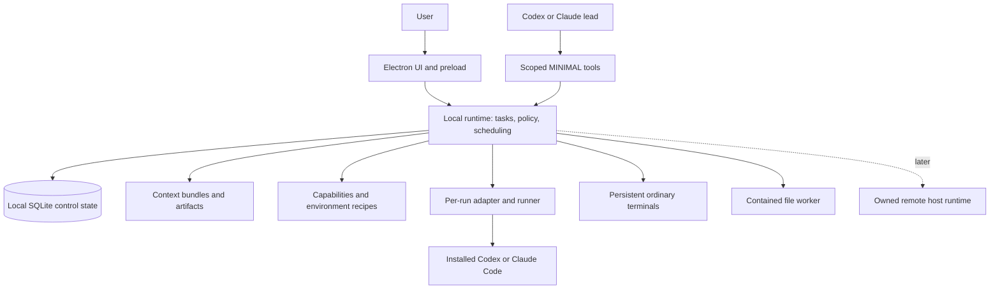

# MINIMAL — a durable workspace for agent-assisted work

> **Implementation planning starts in [IMPLEMENTATION-README.md](IMPLEMENTATION-README.md).** It maps this vision to the inspected v1.2.1 source, resolves contradictions in the detailed specification, and provides the current milestone checklist. The research below is preserved as the 2026-09-10 product proposal; its statements about unavailable source and v1.1 gaps describe that research context. Its original sequencing is superseded by the roadmap. No future implementation is authorized merely by reading these documents.

Research and design specification · 2026-09-10 · Proposed for owner review

Build a workspace in which a person can give Codex or Claude Code a scoped outcome, let work continue independently of the window, understand what happened, and accept a result with evidence. MINIMAL should connect agents, terminals, project context, tools and environments around that complete workflow.

The reasoning agent remains Codex or Claude Code. MINIMAL supplies execution management, reliable state, inspectable configuration, and the user experience around it. This plan does not require LangChain, CrewAI, a new model tool loop, or a new foundation model.

This is a specification, not an implementation report. The current workspace contains the supplied [build snapshot and instructions](ins.md), but no application source. Its existing features, versions and test results are reported evidence, not independently reproduced findings. All new behavior below is proposed. No application code, provider account, deployment or paid service was changed during this research.

## Reading guide

| Reader | Start here |
| --- | --- |
| Product owner | [Product decision](#1-product-decision), [user workflows](#3-the-user-experience), [release plan](#12-implementation-phases), [decisions to review](#15-owner-review) |
| Implementing agent | [Current implementation roadmap/checklist](IMPLEMENTATION-README.md), then the relevant contracts and research below |
| Architect/reviewer | [Decision records](#11-architectural-decisions), [detailed architecture contracts](docs/ARCHITECTURE.md), [research evidence](docs/RESEARCH.md) |

This README preserves the research-era product rationale. [IMPLEMENTATION-README.md](IMPLEMENTATION-README.md) now owns implementation sequencing and progress. The architecture companion defines process ownership, identities, state transitions, migration, failure recovery and test targets, subject to the roadmap's corrections. Research notes preserve evidence and alternatives. Record later owner decisions and their consequences instead of maintaining conflicting master plans.

## 1. Product decision

The first product should serve developers and technical operators who already use coding agents across several projects, especially on Linux/WSL. They need to keep work running, avoid conflicting edits, recover context, and review results without inspecting every terminal continually.

The initial customer is a solo developer or a small technical team using personal workspaces. A shared enterprise control plane, broad nontechnical work automation, and hosting strangers' code are later products with additional requirements. This is a scope recommendation, not evidence that other users would not benefit.

The proposed advantage is the quality of the handoff from intent to accepted work:

1. A task says what result is needed and what proves it.
2. The user can inspect the context, environment, tools and authority before starting.
3. Codex or Claude Code performs the reasoning and uses available capabilities.
4. MINIMAL preserves execution state and brings meaningful decisions to the user.
5. Completion includes a reviewable artifact and verification tied to the actual result.
6. A useful routine can become a versioned recipe and, later, a scheduled task.

Multiple terminals, provider selection, worktrees, MCP configuration and schedules are already competitive features. They are required building blocks, not a defensible novelty claim. The product must earn its place by reducing recovery and review effort for a specific group of users.

### Assumptions used to make the plan concrete

| Assumption | Consequence | Revisit when |
| --- | --- | --- |
| Solo/small implementation team | One modular local runtime, two provider adapters, staged delivery | Independent teams genuinely need separate ownership/deployment |
| Linux/WSL is the working foundation | Preserve it and certify that path first | Native Windows/macOS demand justifies backend work |
| Users already have agent accounts | Provider-owned authentication; MINIMAL pricing is separate | A hosted service and appropriate commercial agreements are validated |
| Reliability is more valuable than maximum agent count | Default two active managed runs globally, one writer per checkout; configurable after measurement | Real workloads demonstrate safe capacity |
| Most tasks have inspectable outputs | Artifacts, diffs, checks and explicit acceptance drive completion | A new domain needs a different acceptance model |
| The owner wants to review before implementation | All decisions remain proposed; code work starts under a later implementation instruction | The owner accepts/refines this specification |

These assumptions let planning proceed without inventing a budget, deadline, target revenue, or guaranteed productivity multiplier.

## 2. What the research changes

The evidence collection covers provider interfaces, direct competitors, workflow engines, environments, protocols, engineering practice and productivity measurement. The [research report](docs/RESEARCH.md) contains the methodology, source ledger, specialist notes, access limitations and unresolved claims.

| Finding | Architectural/product consequence | Evidence |
| --- | --- | --- |
| Native Codex already includes worktrees, review and scheduled tasks with skills/plugins | Compare the proposed workflow against what the user already gets from the provider | [Scheduled tasks](https://learn.chatgpt.com/docs/automations#manage-scheduled-tasks), [worktrees](https://learn.chatgpt.com/docs/environments/git-worktrees) |
| Superset and Emdash already cover much of the intended management surface | Validate a concrete switching benefit before expanding feature breadth | [Superset](https://github.com/superset-sh/superset), [Emdash](https://github.com/generalaction/emdash) |
| cmux documents headless terminal persistence and remote connections | Linux support or keeping a process alive cannot be the whole pitch | [cmux TUI](https://cmux.com/docs/tui) |
| Conductor has local and cloud workspaces; Cursor has cloud agents | Preserve an intentional local/owned-host use case and acknowledge cloud competition | [Conductor](https://www.conductor.build/docs/cloud), [Cursor Cloud Agents](https://cursor.com/docs/cloud-agent) |
| Product support changes quickly: Vibe Kanban announced company shutdown; Crystal is deprecated | Record access dates, preserve exportability, and do not copy stale product assumptions | [Vibe Kanban notice](https://vibekanban.com/blog/shutdown), [Crystal repository](https://github.com/stravu/crystal) |
| Codex exposes structured jobs and rich app-server APIs, but app-server support wording is inconsistent | Start with documented bounded CLI jobs; gate richer integration by version and confirmed support | [Non-interactive Codex](https://learn.chatgpt.com/docs/non-interactive-mode), [app-server caveat](https://learn.chatgpt.com/docs/app-server#connect-a-remote-code-mode-host) |
| Claude Code has native programmatic and background interfaces with distinct lifecycles | Use an explicit adapter and compare native supervision before adding duplicate machinery | [Programmatic Claude Code](https://code.claude.com/docs/en/headless), [CLI reference](https://code.claude.com/docs/en/cli-reference) |

Documentation establishes advertised interfaces, not reliability, current account eligibility, independent security quality, or willingness to pay. Social posts and demos are discovery signals; technical commitments require primary documentation and later contract tests. Performance targets in this report are proposed tests, not achieved results.

### What to retain from the current foundation

Retain independent terminal UUIDs, private tmux ownership, close/reopen without command replay, retained exit state, the named preload boundary, contained file access, flow control, and the ordinary terminal workflow. A terminal remains useful even when it is not attached to a structured task.

The supplied report identifies concrete prerequisites: file-save conflicts, draft loss, interrupted paste delivery, the global batch queue, hanging file requests, weak response types, large directory behavior, delimiter-sensitive process metadata, one global attachment, JSON write amplification, and release-directory contamination. Address these through targeted repairs and tests; a full rewrite is not justified by the report.

The real source must be recovered and inspected before estimating implementation effort. Preserve the existing profile and tmux namespace during experiments. The reported stack versions must be checked against the actual lockfile and packaged runtime.

## 3. The user experience

Keep the main workspace understandable: projects at left, active work in the center, and an optional context/review panel. Terminals remain one click away. A task board can be an alternate view; it should not become a prerequisite for opening a shell.

The primary actions are **New task**, **Open terminal**, **Review**, and **Stop**. Recovery actions say exactly what they do: **Reconnect**, **Answer request**, **Continue session**, or **Start new attempt**. The application should explain what is running, what needs a decision, and what result is ready. Provider-specific technical detail belongs in inspectable details where it affects a decision.

| Action | Consequence shown before activation |
| --- | --- |
| Reconnect / check status | Observe an existing invocation without resending work |
| Answer request | Submit an answer or authority decision to the named pending request |
| Continue session | Use a documented continuation; disclose whether another invocation starts |
| Start new attempt | Create a linked run with refreshed context and applicable authority |
| Stop | Request termination; remain visibly unconfirmed until acknowledged |
| Accept result | Accept the selected evidence/candidate; publication and deployment remain separate |

A persistent attention inbox holds unresolved decisions, failures and review-ready results. It does not steal focus as output arrives. Reading, snoozing or dismissing a notification never grants authority. Preserve a quiet mode and coalesce routine notices. Basic keyboard navigation and draft recovery are part of the first usable increment. [UX evidence and acceptance tests](docs/research/11-ux-attention.md).

### Workflow A — make an existing project ready

The user chooses a project. MINIMAL detects installed providers and environment capabilities through a non-mutating preflight. It shows the effective project instructions, discovered hooks/MCP configuration, Git state and execution mode. It does not run repository setup scripts merely because it found them.

The user selects a provider and an environment. Any setup recipe shows its commands, network needs, secret references and expected changes. On completion, the user can open the same ordinary terminals supported today.

Acceptance: importing a project does not overwrite global dotfiles, discard edits, execute unknown hooks, or start a paid agent request before the chosen action calls for it.

### Workflow B — fix a failing test

The user enters: “Find and fix this failure; preserve the public API.” The task stores that constraint and an acceptance rule. The lead agent inspects selected context, proposes a bounded plan, and receives a managed workspace. MINIMAL exposes the affected scope, expected verification and authority required by that plan.

The agent changes files. Verification runs on the resulting tree. The review view contains the diff, exact tested revision/tree, commands and outcomes, unexplained changes, and a short handoff. The user accepts, requests another attempt, or archives the work. Creating a PR, merging, and deployment remain separate actions with their applicable grants.

Acceptance: a plausible summary or zero exit code cannot mark the requested fix accepted when the specified test did not run or failed.

### Workflow C — coordinate independent work

A lead Codex or Claude Code session decomposes a goal into bounded work items. MINIMAL creates separate workspaces and assigns a writer to each. Independent tasks can run within the shared capacity limit; dependent tasks wait for the required artifacts. The lead can inspect results and propose integration.

Use native provider subagents for supported internal work. Use MINIMAL-managed runs when separate workspaces, providers, hosts or durable task accounting are required. One owner controls each layer's dispatch. Record parent/child relationships and count all observable children against the same allowance; do not recursively launch two uncoordinated orchestration systems.

Acceptance: two writers do not silently share a checkout, and the integration review refers to the combined candidate rather than the separate agents' earlier test results.

### Workflow D — leave and come back

The user closes the GUI. Authorized work continues under the runtime and execution backend. On return, the application shows completed artifacts, decisions awaiting input, failures and stale/unknown observations. Reopening a tab does not rerun a prompt. Acknowledged draft checkpoints restore as unsaved drafts, never as automatic file writes or submitted prompts.

If WSL or the machine stopped, say so. A conversation may be resumable, but the previous process is not still running. Resume and retry are deliberate actions whose authority and side effects are checked.

Acceptance: the same invocation is discovered after GUI closure; a host shutdown cannot create a false “still working” badge.

### Workflow E — turn a routine into automation

After a user successfully repeats a workflow, MINIMAL offers to save its selected instructions, context rules, capabilities, environment and verification as a recipe. The user reviews a concrete manifest. A rehearsal checks dependencies and permissions; it does not claim to predict the model's exact future actions.

Scheduling becomes available after the recipe has passed its own checks. The schedule states the execution host, time zone, missed-run behavior, overlap policy and output destination. A morning dependency review may prepare a report or candidate change; a production action needs the distinct authority its recipe requires.

Acceptance: editing a recipe creates a new version; existing schedules do not silently adopt changed code, tools, permissions or a new mutable dependency.

### Workflow F — move work to another machine

The user registers an owned remote host, verifies identity and capabilities, and chooses which project/context may leave the local machine. MINIMAL prepares an execution workspace there and records its owning host. Reconnection finds the same run. Loss of the network does not launch another copy locally.

Acceptance: a schedule advertised to run while the laptop is off has an available remote scheduler, and remote cancellation is shown as unconfirmed until the host acknowledges it.

### Features worth testing as differentiators

| Proposed feature | User value | Proof required |
| --- | --- | --- |
| Attention inbox | Brings scope changes, failed checks, input requests and ready results together | Less review time without missed failures |
| Context receipt | Separates inputs MINIMAL submitted from inputs the provider confirms loading | Users can inspect the starting context and see visibility gaps |
| Handoff bundle | Transfers objective, state, artifacts and unresolved questions across sessions/providers | Another agent can continue without inventing missing history |
| Configuration preview | Shows effective settings and the source of each change | Switching recipes/providers does not damage existing setup |
| Recipe rehearsal | Finds missing tools, invalid paths and unavailable authority before execution | Fewer failed starts and unexpected setup changes |
| Paired alternatives | Two bounded candidates for a difficult design choice, explicitly requested | Better accepted result after accounting for cost and review time |

These are experiments. A model judging another model is advisory; the user's acceptance criteria and executable checks remain authoritative where applicable.

## 4. Non-negotiable contracts

1. **Work outlives a view.** The GUI owns presentation; the execution system owns authorized work.
2. **Reconnect does not execute.** A missing observation or a restored conversation never implicitly authorizes replay.
3. **Intent, invocation, result and acceptance are distinct.** A PID, a provider message and a passed check answer different questions.
4. **Authority is explicit and reusable within scope.** Existing valid grants remain valid; material changes require new authority. The agent cannot approve itself.
5. **One managed writer owns a checkout.** Parallel writes use separate workspaces and reviewed integration.
6. **An isolation claim names its enforcement.** Worktrees, tmux and prompt instructions do not create an OS sandbox.
7. **Inputs and recipes are versioned.** Context, configuration, tools and environment are inspectable and associated with each run.
8. **Unknown stays unknown.** Missing cost, liveness or completion evidence is never converted into zero, healthy or successful.
9. **Persistence is recoverable.** Version refusal, backups, migration and restore are designed before schema growth.
10. **The product measures accepted work and human effort.** Agent count, tokens and generated lines are diagnostic quantities, not success metrics.

Detailed enforcement and the failure matrix are in [architecture contracts](docs/ARCHITECTURE.md).

## 5. System architecture

The lead is itself a managed or interactive native provider session. The bridge exposes application operations to it; the runtime validates every operation. The runtime does not choose model tokens or implement reasoning. Ordinary terminals and structured agent invocations use separate transports.

### Responsibility map

| Module | Responsibility | Boundary |
| --- | --- | --- |
| Project/workspace | Map existing sessions to execution roots, ownership and Git state | Preserve legacy IDs and user files |
| Task/run | Record requested outcomes, attempts, dependencies and acceptance | No semantic completion inferred from terminal output |
| Execution | Admission, dispatch, process identity, cancellation and reconciliation | Bounded work outside short state transactions |
| Provider adapters | Decode native events and expose tested capabilities | Retain provider-specific differences |
| Context | Select, fingerprint and explain inputs; create handoffs | No silent cross-project memory or upload |
| Capabilities/configuration | Resolve pinned plugins, MCP, commands, hooks, scripts and settings | Preview changes and track provenance |
| Policy | Evaluate grants and environment enforcement | Model text is not an authorization token |
| Scheduler | Admit unique occurrences, handle overlap and missed runs | One owner per schedule |
| Review/artifacts | Diff, evidence, candidate identity and acceptance | Approval invalidated by changed result |
| Observability | Bounded operational events, diagnostics, resource/usage signals | Sensitive contents excluded from default telemetry |

### Persistence and synchronization

Use SQLite for current state, an audit trail and dispatch intents. Store large outputs separately. Use one database writer, an event cursor and a snapshot/replay protocol. Use a private local socket for the desktop client and a narrow tool bridge for agents. Add no message broker, Kubernetes cluster or mandatory cloud account to the local product.

Keep the database on supported Linux-native storage. The current workspace happens to be inside OneDrive, so database location must be an explicit migration check. Preserve the old tmux namespace if a profile's storage location changes. The database binding and shipped runtime are selected through a packaging spike; do not assume Electron or the declared Node minimum supplies a production-ready SQLite interface. [Storage and migration detail](docs/ARCHITECTURE.md#2-identities-and-the-minimum-domain-model).

The existing single attachment can remain during initial managed-run work. Multiple visible terminals require an attachment registry, per-view credits and explicit input ownership before adding panes. Server-side input queues prevent a tab switch from silently truncating a large accepted paste.

## 6. Native agent integration

### Recommended integration order

| Mode | Initial use | Support rule |
| --- | --- | --- |
| Ordinary terminal | Interactive Codex/Claude and all existing CLIs | Human terminal interaction; no inferred task protocol |
| Structured CLI invocation | Bounded managed work with documented JSON results/events | Version-pinned argument/event adapter, contract-tested |
| Native lifecycle integration | Reuse a provider's background/session features where they meet requirements | Capability spike before depending on resume, attach or stop behavior |
| Rich local protocol | Live structured steering/approval UI where justified | Separate compatibility and support gate |
| Official provider SDK wrapper | Optional future convenience when it improves the integration | It wraps the existing agent; it does not introduce a custom reasoning framework |

Codex app-server offers rich client features, but the fetched documentation combines stable-method language with an experimental/unsupported production statement. Do not assume stdio resolves that support question. New work must also avoid depending on deprecated `codex mcp-server`; this is distinct from Codex consuming MINIMAL's MCP tools. [App-server](https://learn.chatgpt.com/docs/app-server), [deprecated server command](https://learn.chatgpt.com/docs/mcp-server).

Claude's machine-output, native background and SDK controls are different integration surfaces. Its hook deferral has a parallel-call limitation, so deferral cannot be the only action gate. A native resumption feature also cannot establish that an interrupted external action had no effect. [Hooks](https://code.claude.com/docs/en/hooks#defer-a-tool-call-for-later).

Choose the first managed provider through a small compatibility spike against the user's actual supported version/account. Keep both available as ordinary terminals. Complete one managed path before promising symmetric controls for both. A feature that cannot be enforced or observed is shown as unsupported or partial, not emulated by parsing an ANSI screen.

### Adapter contract

The internal adapter offers detection, preparation, invocation, structured events, result validation, cancellation, inspection, and documented continuation. Its capability record includes structured output, live input, approvals, resume, native child visibility, usage visibility, sandbox modes and background lifecycle. Each capability includes provider version, evidence/test version and known limitations.

Store raw bounded events for troubleshooting alongside normalized domain facts. Unknown event types should degrade a feature visibly without crashing the workspace. Do not declare arbitrary unknown provider versions fully supported. A model change is not the same thing as a CLI protocol change; record both.

### Authentication and commercial boundary

Let the installed provider own login and token refresh. Do not read its credential file to construct a different sign-in experience. MINIMAL should show account mode and readiness, not raw credentials. No silent switch from subscription use to billable API use, account pooling or provider substitution.

Current Claude documentation distinguishes allowed unmodified-binary arrangements from prohibited credential intermediation, and its SDK has separate conditions. Subscription treatment has also changed during 2026. Validate the concrete distribution/authentication model against current terms before commercial release; this report grants no redistribution or usage rights. [Claude terms guidance](https://code.claude.com/docs/en/legal-and-compliance), [plan update](https://support.claude.com/en/articles/15036540-use-the-claude-agent-sdk-with-your-claude-plan), [Codex authentication](https://learn.chatgpt.com/docs/auth).

## 7. Plugins, MCP, commands, hooks and configuration

Build one catalog with distinct capability kinds. Avoid presenting every item as an interchangeable plugin.

| Kind | What the user manages | Required controls |
| --- | --- | --- |
| Skill/instruction package | Reusable native-agent guidance and supporting files | Source, version, allowed scope, progressive loading |
| Native plugin | Provider-specific bundle of features | Compatibility, install origin, permission changes |
| MCP server | Tool/context service consumed by the native agent | Transport, authentication reference, tool allowlist, timeout, health |
| Command | Named user action with arguments | Input schema, working directory, explicit shell/argv semantics |
| Script | Versioned executable file or entrypoint | Digest, environment, deadline, output and failure policy |
| Hook | Action triggered at a specified lifecycle point | Native/runtime distinction, recursion limit, blocking/nonblocking semantics |
| Context source | Repository, file set, document collection | Revision, freshness, trust, outgoing-data policy |
| Environment template | Tools, image, mounts, setup, resources | Immutable versions, declared powers, cleanup and reproducibility |
| Recipe | A repeatable workflow joining the above | Input/output contracts, dependencies, checks and approval policy |

A manifest includes ID, version/digest, publisher/source, compatibility, dependencies, capabilities requested, secret references and lifecycle policy. Installing, enabling and granting authority are separate states. Updates create inspectable differences; active recipes keep their pinned versions.

Begin with a curated local catalog and import/export. A public marketplace would add publisher identity, malware handling, vulnerability response, signing, revocation, moderation and commercial work. It is a later decision, not a prerequisite for using installed native plugins.

### Configuration precedence

Preferences can use defaults → user → project → recipe → run overrides. Restrictions compose by intersection. A project cannot broaden an organization restriction, and an agent-generated override cannot broaden the accepted task grant.

Show the effective value, where it came from, the provider-specific output, and unsupported translations. Preserve user originals and use project/run-scoped configuration where documented. Never silently rewrite global `AGENTS.md`, `CLAUDE.md` or provider settings to fit MINIMAL.

### MINIMAL as a tool provider

Expose a small local MCP bridge or management CLI, both calling the same validated runtime API. Initial tools should cover inventory, task status, run inspection, bounded artifact reads and explicit creation/stop requests. Add external mutations only with appropriate grants.

Tool arguments identify requested scope; they do not prove authority. The runtime derives principal and maximum scope from the connection. A user-supplied `projectId` cannot let one task control another. Avoid a generic “execute anything with all credentials” management tool.

MCP, editor-agent protocols and skill packages solve different problems. Pin the negotiated protocol and tested provider versions; newer specifications do not imply all clients support them. [Protocol research](docs/research/04-protocols-extensions.md).

## 8. Context and agent practice

Every managed run is submitted with a context bundle containing the objective, constraints, acceptance rules, selected source revisions, workspace/base identity, tool availability, authority, and expected output. The user can inspect it. Distinguish submitted inputs from provider-confirmed loading, later observed retrieval and unknown native context. The bundle records provenance and the exclusions that matter; it need not copy the entire repository into a prompt.

Use ordinary file selection and search before adopting an external memory service or vector database. Add retrieval infrastructure only after measuring a specific failure: missed relevant sources, unacceptable latency or repeated context reconstruction. Context repositories are read-only inputs by default, pinned to revisions and updated through an explicit action.

Provider-native repository instructions and compaction remain native. MINIMAL coordinates which inputs are attached and preserves explicit handoffs; it does not promise to reconstruct a provider's hidden state. Preserve each provider's instruction resolution and memory scope, including possible sharing across worktrees. Cross-provider handoff transfers artifacts and a reviewable summary, not an allegedly identical conversation. [Context research](docs/research/07-context-practice.md).

Recommended work discipline:

1. Inspect the real project and constraints before proposing edits.
2. Give tasks bounded ownership and verifiable outputs.
3. Keep planning proportional to uncertainty; a one-file fix does not need a committee.
4. Run independent work concurrently only when its expected benefit exceeds coordination and review cost.
5. Verify changed behavior and preserve the evidence; do not test merely to manufacture a green badge.
6. Review the final candidate, including scope changes and unresolved risks.
7. Promote reusable practice into a versioned skill or recipe after it has demonstrated value.

Web pages, issue text, retrieved documents and tool output remain untrusted source material. An instruction embedded in them cannot change task authority or justify exposing secrets. Shared memory must have scope, provenance, expiry/deletion and an explicit promotion process before it becomes standing guidance.

## 9. Automation, time and DevOps

Implement a small deterministic workflow runner with `agent`, `command`, `check`, `approval` and `artifact` steps. Add dependencies and bounded fan-out when the user workflow needs them. Every step declares inputs, outputs, timeout, retry classification and side-effect policy. There is no need for a visual graph editor in the first release.

The lead agent can propose or populate a workflow. The runtime validates it and enforces its transitions. A natural-language request is not a substitute for a durable step record when the app promises resumable automation.

Borrow proven semantics from workflow systems: durable waits, explicit retry limits, concurrency scopes and observable step state. Adopt an external platform only when local scheduling/recovery cannot economically satisfy a validated requirement. [Workflow comparison](docs/research/05-workflows-time.md).

### Time semantics that must be visible

| Concern | Required behavior |
| --- | --- |
| Recurrence | Store rule, IANA zone and next UTC occurrence; show human-readable schedule |
| Missed run | Skip by default; optional bounded coalescing, never unbounded replay |
| Overlap | Default no overlap for one recipe/project; queue or skip explicitly |
| Sleep/shutdown | Record missed/interrupted work; do not imply the local machine ran while off |
| Deadline | A concrete elapsed limit and stop policy; OS/provider enforcement limits disclosed |
| Human wait | Separate waiting time from active execution time |
| Retries | Retry only classified operations with bounded attempts and backoff |
| Spend | Label provider-reported usage, estimate and enforceable cap separately |
| Remote schedule | One owning scheduler on an available host; reconnect does not transfer ownership |

Start DevOps features with evidence collection: inspect failed CI, gather logs, compare desired configuration, prepare release notes, generate a deployment plan. Use existing GitHub/GitLab CI and infrastructure tools as execution systems. MINIMAL coordinates artifacts and decisions around them.

Production mutation needs the exact environment, artifact/revision, command, credentials and rollback/verification procedure tied to its grant. A reviewed plan that later changes is a new candidate. Do not automatically apply an infrastructure plan merely because an agent wrote “safe to deploy.”

Shared Git hooks and refs need repository-level coordination in addition to checkout ownership. Promotion must recheck the target base and the exact reviewed candidate; infrastructure plans must remain bound to the approved execution target. Existing CI environment approvals alone do not prove artifact identity. [Git/DevOps research](docs/research/08-git-devops.md).

## 10. Environments and security

Offer clearly labeled execution modes: trusted local host, restricted local environment, and owned remote environment. Detect actual filesystem, process, network, resource and credential boundaries. Show unsupported constraints before dispatch.

For parallel development, worktrees solve edit ownership. Containers or stronger isolation address a different problem. Environment templates can build on Dev Containers and existing container/remote providers. Prefer integrating a proven execution backend to inventing a hypervisor or container manager. [Environment research](docs/research/06-environments-remote.md).

An untrusted run must not receive the runtime socket, host home, container-engine socket, unrestricted SSH agent or deployment credentials by default. Keep powerful external actions in a scoped broker when they must be mediated. Trusted-host mode cannot promise to contain arbitrary same-user shell code.

Keep renderer isolation, explicit IPC validation and the file provider's existing protections. Add typed helper responses, bounded work, expected file versions, draft recovery and recoverable deletion where feasible. A timed-out recursive mutation may be partial; surface that result and reconcile it.

Default telemetry contains operational counters and error classifications. Repository content, prompts, terminal output, paths, credentials and artifacts require an explicit diagnostic export or separately selected collection policy. Keep local history inspectable, exportable and subject to documented retention.

## 11. Architectural decisions

All records are **proposed**. The selected direction is specific enough to implement after owner acceptance; revisit triggers prevent it becoming an unquestioned permanent constraint.

| ADR | Decision and reason | Alternative/trade-off | Revisit trigger |
| --- | --- | --- | --- |
| 001 | Keep Codex/Claude as native reasoning agents | Less uniform control than a custom loop; avoids rebuilding agent behavior | A verified native limitation blocks a valuable workflow |
| 002 | Retain Electron/React/TS and tmux; refactor ownership incrementally | Keeps Linux dependencies and existing platform limits | Measurements show an unfixable constraint or funded native-platform requirement |
| 003 | Separate local runtime and per-run transport ownership | More process/packaging work than doing everything in Electron main | A native provider lifecycle can satisfy the same tested contract more simply |
| 004 | SQLite state plus artifacts and audit events | Migration and bundled-engine maintenance instead of JSON simplicity | Real multiuser/distributed write requirements appear |
| 005 | Explicit run identity, dispatch intents, reconciliation; no implicit replay | Some failures need a user decision rather than automatic retry | A backend provides provable idempotent reconciliation |
| 006 | Structured CLI first; rich provider APIs capability-gated | Initial feature asymmetry and fewer live controls | Pinned adapter tests and provider support establish a stronger contract |
| 007 | One writer per checkout, separate workspaces for parallel changes | More disk/setup cost | Measured workload supports a safer specialized collaborative model |
| 008 | Typed capability catalog with pinned manifests | Curated breadth and maintenance work; no universal plugin magic | Repeated demand justifies public distribution infrastructure |
| 009 | File/search-first context and explicit handoff artifacts | Less automatic memory; higher transparency | Retrieval evaluation demonstrates a clear need for indexing |
| 010 | Small local workflow state machine and scheduler | Fewer enterprise workflow features | Reliability or multi-host requirements justify Temporal/another platform |
| 011 | Host-local authority with SSH-based remote transport later | No seamless multi-master operation | Validated shared-team workflow funds distributed ownership/security |
| 012 | Grants and measured environment enforcement | Trusted-host mode has limited containment | Users require hostile-code or multi-tenant isolation |
| 013 | Local supervised workflow before autonomous deployment/marketplace | Delays breadth and possible revenue paths | Repeated use and economics support the expansion |

Full rationale and consequences for state/process ownership are in [architecture contracts](docs/ARCHITECTURE.md). Provider, environment and workflow notes document the alternatives behind the other choices.

## 12. Implementation phases

Deliver complete user workflows in small increments. Phases are ordered by dependency, not promised calendar dates. Estimates require the actual repository, team availability and initial spikes. No phase passes on prose or a compilation check alone.

### P0 — establish a recoverable baseline

Recover the application source, read repository guidance, inspect the actual lockfile and packaging, establish a version-controlled baseline, and reproduce the stated checks in an isolated profile. Preserve any user work. Inventory the current schema, tmux namespace and filesystem assumptions.

Repair the highest-impact foundation issues first: file conflict handling/drafts, keyboard/focus behavior, typed and cancellable helper requests, batch queue responsiveness, paste ownership, robust metadata parsing, and clean staged packaging. Record baseline CPU/RAM/startup/terminal-switch measurements and failure cases. Select a patched SQLite engine/binding and the separately runnable package runtime through a small spike.

Gate: a baseline report links to actual code/tests; isolated close/reopen does not replay commands; corrupt state remains recoverable; stale saves are detected under the supported writer model; acknowledged drafts survive restart; terminals/dialogs work by keyboard; the packaged app runs without a global Node install. Do not certify untested architectures or promote the snapshot's historical test results into fresh results.

### P1 — extract runtime ownership and migrate state

Move domain state behind the local runtime while preserving the existing UI contract as an adapter. Add one-writer ownership, SQLite migrations/backups, a state/event cursor, and stable execution namespace. Keep terminals and basic file operations working throughout.

Gate: migration preserves IDs/presets/tombstones, drafts and existing workers; duplicate runtime startup is harmless; old versions cannot overwrite the new schema; restore is tested with execution disabled; a GUI crash does not own running terminals; focus and status announcements remain usable across reconnect. [Migration protocol](docs/ARCHITECTURE.md#9-recovery-and-migration-acceptance-matrix).

### P2 — complete one managed single-agent workflow

Implement task, run, invocation and artifact records; basic context bundles; grants; capability preflight; a persistent decision/review inbox; one version-tested structured provider adapter; and a runner with bounded event storage. Preserve ordinary terminal mode for both providers. Add the second managed adapter after the first loop passes.

Build the complete “fix a failing test” path: prepare → invoke → observe → verify → review → accept. Compare native provider background lifecycle against MINIMAL's runner before adding duplicate supervision. Resolve the supported provider/version/authentication model for this pilot.

Gate: no duplicate prompt after GUI/runtime recovery; malformed output cannot complete a task; unknown provider version degrades visibly; permission denials remain effective; review refers to exact artifacts. Demonstrate the loop on a disposable real project with authorized provider access.

### P3 — coordinate work and reuse setup

Add separate managed workspaces, writer leases, parent/child tasks, bounded parallel admission, candidate integration and evidence review. Add curated capability manifests, configuration preview, project recipes, native-hook/MCP import and explicit context handoffs. Keep the first recipes small.

Gate: parallel writers do not collide; initial user changes survive setup; stale acceptance is rejected after a diff changes; failed tests block acceptance; changing provider shows unsupported settings. Run comparative recovery/review trials with early users before expanding.

### P4 — automate predictable work and handle time

Add deterministic steps/dependencies, unique schedule occurrences, durable waits, retry classification, time-zone/misfire/overlap rules, history and schedule triage in the existing attention inbox. Start with read-only maintenance and candidate-producing jobs. Add scoped CI/DevOps actions only after evidence and authority paths work.

Gate: clock/sleep/restart/DST fixtures do not duplicate work; schedules can be paused and audited; queue cancellation remains responsive; budget displays distinguish estimates from enforced limits; no external mutation occurs under stale approval.

### P5 — support owned remote execution

Add host registration/identity, connection capabilities, remote filesystem/runner interfaces, environment templates, host-local scheduling, bounded synchronization and cleanup records. Select one remote execution backend first. Give every run and schedule one owning host.

Gate: network partitions preserve run identity; retries do not spawn replacements; cancellation uncertainty is explicit; context export matches selected scope; credentials stay within their intended boundary; abandoned resources remain visible for cleanup. A laptop-off test demonstrates any advertised remote scheduling guarantee.

### P6 — qualify the paid product and expand selectively

Complete onboarding, accessibility/keyboard behavior, signed/staged releases as appropriate, compatibility diagnostics, backups/export, support tooling, dependency/license attribution and update rollback. Packaging and essential safety gates begin in P0 and continue throughout; they are not postponed until this phase.

Validate retention and willingness to pay for the demonstrated workflow. Decide whether native Windows/macOS, team features, a hosted service, broader integrations or a public marketplace offer the strongest measured benefit. Each expands the support and trust model and needs its own decision record.

Gate: commercial/auth rights reviewed for the actual distribution; end-to-end workflow and recovery suite passes; no blocking usability issue; support/hosting costs have a plausible margin; real users return without being prompted by the study.

### Scope explicitly deferred from the first managed release

Full IDE replacement, collaborative document editing, public plugin marketplace, custom multi-agent framework, mandatory vector database, Kafka/Redis infrastructure, multi-tenant hosted execution, automatic provider fallback, autonomous production deployment, mobile clients and unrestricted recursive agent spawning.

These may become useful later. Each requires observed user value and a plan for its continuing operational cost.

## 13. Evaluation, product validation and economics

The primary outcome is accepted work completed with less human active time and no increase in escaped defects. Track success rate, review effort, recovery effort, unintended duplicate execution, configuration damage, cost per accepted result and voluntary reuse. Report task mix and failures, not only successful demos.

Compare at least three conditions on representative work: the user's current terminal/provider workflow, the native provider product where available, and MINIMAL. Include simple tasks where orchestration may be unnecessary and difficult tasks where verification dominates. Counterbalance order and record the supported provider/model versions, repository revisions and account mode.

A small usability pilot is qualitative evidence. It cannot justify a universal “10×” claim. Fix acceptance criteria and decision thresholds before running a study, then report uncertainty and negative results. [Evaluation research](docs/research/10-evaluation-productivity.md).

Suggested early validation: interview 8–12 developers about recent real tasks, observe 6–8 using the pilot, and follow voluntary use for two weeks. These are proposed study sizes, not statistically powered estimates. Ask what they would remove from their current workflow and why they returned; do not infer demand from social engagement.

### Commercial hypothesis

Keep provider usage and remote compute financially separate from the workspace subscription. A potential paid offer is dependable project/run history, reusable configuration, richer recovery/review and owned-host automation. Team policy and audit features may support a later tier. Price points require testing and support-cost estimates; no market price or revenue projection is asserted here.

Calculate contribution margin from workspace revenue minus payment fees, support, update/compatibility maintenance, included infrastructure and incident handling. If the user pays providers directly, do not count that usage as MINIMAL revenue. If compute is ever included, add a separately measured per-run cost and limit policy.

Avoid locking essential export, access to existing local files, or recovery of already-created work behind continued subscription payment. The business should sell recurring value while preserving user ownership. The [commercial research](docs/research/12-commercial-positioning.md) develops the experiments and release questions.

## 14. Instructions for the implementing agent

Use this section after the owner gives an implementation instruction. This research request itself does not authorize building or provisioning the product.

1. Read this README, the relevant architecture contracts, accepted ADRs and actual repository instructions. Distinguish the supplied snapshot from inspected code.
2. Start at the first incomplete phase. Confirm the phase's entry conditions and choose one useful end-to-end increment.
3. Inspect existing behavior before changing ownership. Preserve unrelated edits, profiles, terminal identities and running work.
4. Write a short implementation plan naming the files/modules, state changes, failure behavior and acceptance evidence. Resolve ordinary choices autonomously within accepted scope.
5. Use the installed native agent through supported interfaces. Do not introduce a model orchestration framework to satisfy a missing transport detail.
6. Recheck current provider/protocol documentation and pin the compatibility contract. Do not copy obsolete flags or assume account access from a documentation page.
7. Keep transitions, argument validation, permissions and persistence deterministic. Bind authority to actual targets and artifacts; preserve existing grants within scope.
8. When delegating, assign explicit file/workspace ownership and bounded outputs. Use parallel work where independent; serialize integration. Never use agent count as a progress target.
9. Implement and verify the current increment before broadening it. Choose meaningful tests for the risk: state transitions, adapter fixtures, recovery, file conflicts, packaged lifecycle and the user's actual workflow.
10. On failures, preserve evidence and diagnose. Do not delete state, reset the repository, disable containment, skip failing checks or add unconditional replay to get a green result.
11. Stop for new direction only when a material product choice, unavailable authority or external dependency prevents safe progress. Present the concrete prepared work and exact blocker. Do not repeatedly ask for already-granted authority.
12. Finish with the change, its behavior, evidence, limitations and the next phase gate. Mark partial support and skipped checks explicitly.

Every accepted increment should leave an implementation record with code/revision, migration impact, tests run, compatibility versions, remaining risks and updated decisions. Avoid a second contradictory “master prompt.” This README plus its accepted changes is the planning entry point; the repository and verified tests establish actual behavior.

## 15. Owner review

The recommended starting decision is to build a reliable local Linux/WSL task-to-review workflow around installed Codex and Claude Code, while preserving the terminal product that already works.

Review these product choices before implementation planning:

- The first audience and the reason it would switch from its current tools.
- The default execution mode and which isolation guarantees the first release will certify.
- Which provider/version/account path passes the initial managed-adapter spike.
- Whether the first paid value is local recovery/review, owned-host automation, or another experimentally supported need.
- Which phase is funded next and which measurable result permits expanding scope.

Refinements should state what changes, why, and which acceptance criteria or ADRs are affected. The research notes are evidence to challenge these decisions, not a claim that the product's success is already established.
