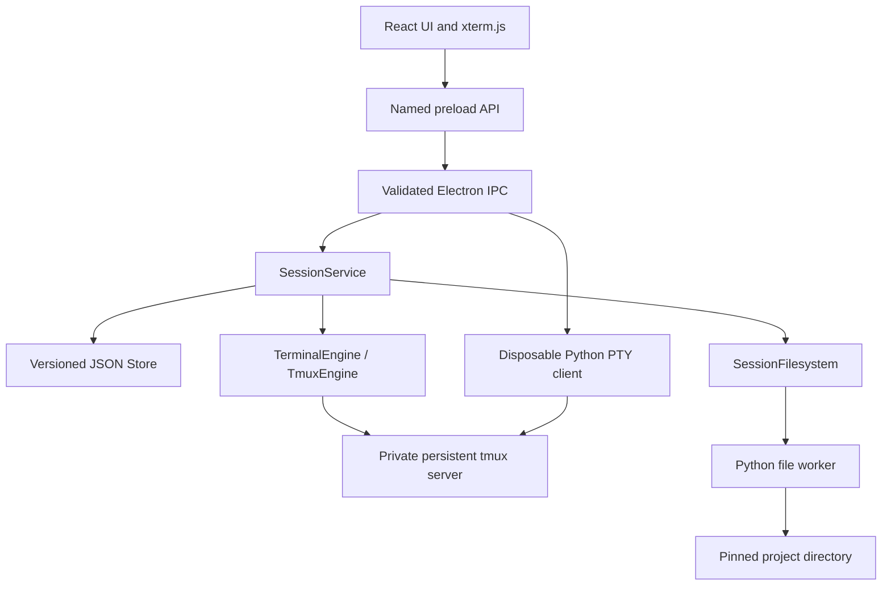

This was my very first build, i mean what i built so far:
# MINIMAL v1.1 — Build snapshot and engineering handoff

**Snapshot date:** September 9, 2026  
**Application version:** 1.1.0  
**Persistent state schema:** version 1  
**Purpose:** Give a reviewing agent an accurate baseline before optimizing the foundation or designing larger automation, productivity, management, and time-handling features.

This report describes the current source tree and the verification recorded during its implementation. Feature gaps and engineering review targets are explicitly identified; they are not implemented capabilities. Application code was not changed for this report. Tests were not rerun solely to write it.

## 1. What the product currently is

MINIMAL is a local desktop workspace that groups a project directory with independent, persistent terminals and a scoped file explorer.

A user creates a session for a folder, launches one or more commands, switches between projects and terminal tabs, edits project files, and closes the application while terminal processes continue in a private tmux server. Reopening reconnects to surviving work.

The current deliverable is a working Linux/WSL desktop foundation. Its built-in automation consists of reusable command presets, batch launches, and recovery of application bookkeeping. It has no task scheduler, structured workflow engine, agent coordination layer, or time-tracking system.

Commands such as `codex`, `claude`, `opencode`, and `pi` are supported through ordinary terminal execution. Those tools must already be installed and configured. MINIMAL does not integrate their SDKs, manage their authentication, interpret their conversations, or coordinate their tasks.

## 2. Platform and delivery

| Item | Current position |
| --- | --- |
| Supported runtime | Linux; Windows usage through WSL2 with WSLg |
| Verified environment | Linux x64 under WSL2/WSLg, including project files on the Windows-mounted workspace |
| Kernel requirement | Linux 5.6+ for the file provider's `openat2` containment |
| External runtime dependencies | tmux 3.2+, Bash, Python 3.9+, and Linux desktop libraries |
| Development requirement | Node.js 22.12+ and npm |
| Packaged artifact | `release/minimal-linux-x64/minimal`, with its adjacent runtime/resources |
| Other architectures | Packaging uses the host architecture; ARM64 has not been verified in this build |
| Native Windows/macOS | Not implemented |
| Window | One application window per profile; default 1440 × 920, minimum 1000 × 640 |
| Installation/update experience | Runnable application directory; no installer or automatic updater |
| Network dependency | The application UI and local backend work offline; launched programs may use the network |

The package bundles Electron and compiled application code. It does not bundle tmux, Bash, Python, or the coding agents. A global Node installation and a development server are unnecessary when using the package.

## 3. Technology stack

Versions below are resolved versions in `package-lock.json`, rather than claims about the newest available releases. Most manifest dependencies use caret ranges; `npm ci` uses the lockfile.

| Technology | Version / configuration | Responsibility |
| --- | --- | --- |
| Electron | 44.2.0 | Desktop window, main process, preload bridge, native dialogs and clipboard |
| React / React DOM | 19.2.8 | User interface and component state |
| TypeScript | 7.0.2 | Shared contracts and application implementation |
| Vite | 8.2.2 | Renderer build and asset bundling |
| esbuild | 0.28.2 | Main-process and preload CommonJS bundles |
| xterm.js | 6.0.0 | Terminal rendering, escape sequences, input and selection |
| xterm FitAddon | 0.11.0 | Fit terminal geometry to the available panel |
| Zod | 4.5.4 | Runtime validation of state and request payloads |
| lucide-react | 1.43.0 | UI icons |
| Playwright | 1.63.0 | Electron desktop automation and packaged-runtime verification |
| tsx | 4.23.13 | Execute TypeScript tests and verification scripts |
| Node built-ins | Bundled Electron runtime / development Node | Child processes, filesystem, crypto, streams and backend tests |
| Python standard library + libc calls | External Python 3 | Disposable PTY bridge and descriptor-based file operations |
| tmux | External installation | Persistent terminal ownership, process inspection, history and attachment |
| Bash | `/bin/bash` | Execute commands and provide interactive shells |
| CSS and system fonts | Repository CSS | Fixed dark theme, layout and offline typography |

TypeScript enables `strict`, `noUnusedLocals`, and `noUnusedParameters`. There is no database server, ORM, web backend, cloud service, AI SDK, external state-management library, Monaco editor, or custom native Node addon.

The manifest declares the project private and uses the ISC license identifier. License packaging and third-party attribution have not received a separate distribution audit.

## 4. Supported user features

### Project sessions

- Create a session from a folder chosen through a native chooser or an absolute Linux path.
- Display project name, folder, terminal count, and running count in the sidebar.
- Search sessions by name or directory.
- Switch between sessions while their processes continue running.
- Rename sessions.
- Delete a session with confirmation, stopping its terminals while preserving project files.
- Keep an empty session and add terminals to it later.

### Command launching and presets

- Open a command box and enter any Bash command or installed CLI.
- Leave the command blank to start an interactive Bash shell.
- Launch 1–32 copies of one command in a batch.
- Choose a working subdirectory within the session root for the initial launch.
- Supply an optional terminal label; automatic labels receive unique numeric suffixes.
- Choose, edit, create, and remove reusable global command presets.
- Save a command as a preset directly from the launch dialog.
- Add more batches while existing terminals run.
- Start each newly opened launch dialog with quantity one.
- Reuse the last launch command, label, and subdirectory for that session during the current GUI lifetime.

Each batch uses one command and one initial working directory. A preset stores only an ID, name, and command; it is not a full project template or a collection of different commands.

### Terminal interaction and management

- Give every terminal an independent UUID and tmux session.
- Keep **+ New terminal** visible outside the horizontally scrolling tabs.
- Put an **×** on every tab to immediately stop and remove that terminal.
- Preserve the active selection when an inactive tab is closed.
- Select a surviving neighbour when the active tab is closed.
- Keep the selected tab visible as tabs change or the available width changes.
- Rename a terminal independently.
- Use **Edit & run** to prefill the existing command and launch another terminal after review.
- Use **Reconnect** to attach to surviving work without starting another command.
- Show process name, terminal-pane PID, current directory, connection state, and exit code where available.
- Support normal terminal input, Unicode, ANSI rendering, resizing, and terminal applications through xterm/tmux.
- Support Ctrl+C, mouse scrolling, Ctrl+Shift+C / Ctrl+Shift+V, and right-click copy-selection-or-paste.
- Retain the terminal screen and exit code after a command finishes while its tmux session remains available.

Only one terminal is displayed and attached at a time. **Edit & run** creates a new terminal; it does not reset the existing one in place. Closing a tab is immediate and has no undo. A running process is not evidence that an agent is healthy, busy, or successfully completing a task.

### Explorer and file editing

- Browse the current folder and navigate to its parent within the project root.
- Refresh manually; navigation and successful file actions also refresh the listing.
- Create files and folders.
- Rename, move, and permanently delete selected items; deletion requires confirmation.
- Reject moves onto an existing destination.
- Open and edit UTF-8 text, with explicit Save and unsaved-change indication.
- Ask before discarding edits when closing the file preview through its own controls.
- Preview PNG, JPEG, GIF, and WebP images.
- Display a read-only hexadecimal/ASCII preview for other files.
- Identify blocked links/special files in the listing.
- Hide or show the explorer to change the space available to the terminal.

This is a basic single-file editor. It has no syntax highlighting, language server, project-wide search, file watching, conflict resolution, integrated Git, trash, or version history.

### Presentation persistence

The selected session, selected terminal per session, and explorer visibility are stored in renderer local storage. Last-launch settings are in memory, not durable history. The current explorer folder, unsaved editor contents, window geometry, and arbitrary layout state are not restored as a complete workspace snapshot.

### Practical uses available today

| Use | How the current build supports it | Boundary |
| --- | --- | --- |
| Work across several projects | Give each project its own folder-bound session and persistent terminals | No project tags, archive, or shared dashboard beyond session counts |
| Run a development environment | Launch frontend, backend, tests, and log-following commands in separate terminals | Different commands require separate launches; there is no ordered startup or readiness dependency |
| Use several coding agents | Launch installed agent CLIs independently and switch between them | Agents receive no coordinated task/context model and can conflict when editing the same files |
| Keep local jobs running | Run builds, test watchers, scripts, or other long-running commands and close the GUI | No deadlines, alerts, job history, or survival through OS/WSL shutdown |
| Reuse routine commands | Save common commands as presets and launch another copy quickly | Presets do not store environment variables, secret references, dependencies, or a complete workspace layout |
| Inspect and make small file edits | Use the explorer and text/image/byte previews alongside terminals | The editor has no external-change conflict checks or language tooling |

Git, worktrees, external schedulers, and other CLI tools can be invoked manually inside a terminal when installed. That general command capability does not constitute built-in integration with those systems.

## 5. Architecture and ownership



| Layer | Responsibility |
| --- | --- |
| React renderer | Forms, session selection, terminal tabs, file panel, errors and presentation preferences |
| Preload | Expose specific typed `window.minimal` methods without giving the renderer general Node access |
| Electron main | Window lifecycle, sender validation, IPC payload validation, clipboard and attachment ownership |
| `SessionService` | Domain state, launch/remove/rename operations, serialization, reconciliation and snapshots |
| `Store` | Validate and persist versioned session/preset metadata |
| `TerminalEngine` | Contract for initialize, inspect, create, remove and attach |
| `TmuxEngine` | Translate that contract into operations against a private tmux socket |
| PTY helper | Connect the selected terminal to tmux through a disposable PTY and stream input/output |
| File provider | Keep file operations outside the main thread and enforce project-root containment |

The Electron main process currently has one global attachment, guarded by a generation counter and token checks. Multiple panes or simultaneous attached views would require changing this ownership model, not only adding layout components.

The typed API covers snapshots, session CRUD, terminal launch/rename/delete, preset saving, files, attachment, input, resize, output acknowledgement, clipboard, and output/exit subscriptions. The older preset-only `createTerminals` call delegates to `launchTerminals`.

These are internal trusted-renderer APIs. There is no external management CLI, HTTP endpoint, MCP server, plugin host, or public automation API.

## 6. Data model and persistence

| Record | Stored fields |
| --- | --- |
| `State` | Schema version, presets, sessions |
| `Preset` | UUID, name, command |
| `SessionRecord` | UUID, name, canonical directory, device/inode identity, creation timestamp, terminal records, optional deletion marker |
| `TerminalRecord` | UUID, label, initial directory, command, creation timestamp, optional deletion marker and launch error |
| `TerminalView` | Stored terminal fields plus derived status, pane PID, current process, current directory and exit code |
| `Snapshot` | Sequence number, sessions, presets and optional engine error |

The profile is normally Electron's user-data directory, commonly `~/.config/MINIMAL`. `MINIMAL_DATA_DIR` selects a different profile. The private tmux socket is derived from that profile path and lives under `/tmp/minimal-<uid>/`.

`state.json` stores metadata. tmux stores live processes, terminal screens, and its in-memory history. Renderer local storage holds a small amount of presentation state. Project files remain in their original directories.

State writes use a temporary file, file synchronization, rename, and directory synchronization. In-memory domain state changes only after a successful save. This protects individual metadata writes; it is not a database transaction spanning filesystem actions and process creation.

Launch records are saved before processes are created. If launch stops halfway through, started IDs can be reconciled with tmux; unstarted records remain visible without replaying their commands. Deletion markers are saved before stopping work and can be retried idempotently.

There is no backup/restore interface, import/export, recovery wizard, encryption, event history, or general schema-migration framework. Commands are persisted as plaintext, so secrets embedded in command text also become persisted metadata.

## 7. Process lifecycle and recovery

| Event | Current behavior |
| --- | --- |
| Launch a command | Run `/bin/bash -lic <command>` in a new dedicated tmux session |
| Launch blank command | Start `/bin/bash -l` as an interactive terminal shell |
| Switch tab/project | Dispose of the view attachment and attach to the selected terminal; underlying work continues |
| Close GUI | Detach the client; tmux owns surviving work independently |
| Reopen GUI | Load saved metadata and inspect the private tmux server |
| Command exits | Preserve its tmux pane, screen and exit status |
| Terminal disappears | Keep a missing record; do not relaunch automatically |
| One batch launch fails | Record its failure and continue attempting the remaining batch |
| Inspection fails | Keep saved workspace metadata visible with unknown status; poll again |
| Attachment ends | Show disconnection and offer explicit Reconnect |
| File helper exits | Reject pending requests; start a new helper on the next operation and revalidate root identities |
| Profile JSON is invalid | Show a startup error and preserve the file |
| Reboot / WSL shutdown | Processes and tmux memory do not survive; metadata alone does not recreate them |

The shell startup configuration contributes to the environment and aliases available to a launched command. MINIMAL does not capture or isolate that environment. A terminal close removes its tmux session; escaped or deliberately daemonized child processes are not managed as a complete application process tree.

Saved creation timestamps describe records/launch intent. There are no durable start/end events, task durations, pause/resume records, deadlines, or time-zone-aware schedules.

## 8. Security and filesystem boundaries

Implemented controls include:

- Sandboxed Electron renderer, context isolation, disabled Node integration, and enabled web security.
- Exact main-frame sender validation for IPC and validation of exposed request payloads.
- Denial of new windows, navigation, webviews, and permission requests.
- A local Content Security Policy, including `connect-src 'none'` for the renderer.
- Dedicated tmux configuration/socket and ownership/permission checks on the socket directory.
- Separate argv for process-management operations; user-authored command text intentionally executes through Bash.
- Closure of inherited nonstandard file descriptors before Python helpers execute terminal-management programs.
- Pinned file-root descriptors and saved device/inode identity.
- Linux `openat2` resolution that rejects directory traversal, followed symlinks, magic links, and mounted subtrees.
- Restrictions on opening special files and files with multiple hard links.
- Atomic replacement for text writes and protection against overwriting move destinations.

The explorer's root is a file-access boundary. User-launched shells and agents still have the normal permissions of the operating-system user and may change directory, access other files, or use the network.

The implementation trusts its installed code, user profile, and OS user. It is not a multi-user or adversarial-code sandbox. No independent penetration test or comprehensive race-condition audit is recorded.

On WSL Windows mounts that lack `RENAME_NOREPLACE`, moves use destination reservation followed by link/unlink for files or mkdir/rename for directories. These fallbacks have different interruption behavior from a native atomic rename and merit continued concurrency testing.

## 9. Limits and performance mechanisms

| Limit / behavior | Current value |
| --- | --- |
| Terminals per launch | 1–32 |
| Terminal records per session | 128, including retained exited/missing records |
| Global process/session budget | No explicit application-wide cap |
| Presets | Up to 100; preset editor retains at least one |
| Command length | 8,192 JavaScript string code units; NUL rejected |
| Text read/edit | 2 MiB, with backend UTF-8 byte-size enforcement |
| Supported image preview | Up to 10 MiB |
| Generic file preview | First 1,024 bytes displayed |
| Folder listing | Rejects listings over 20,000 entries |
| tmux history | Up to 20,000 lines per terminal |
| xterm local scrollback | 10,000 lines per mounted terminal view |
| Status refresh | Next poll scheduled 2 seconds after the previous poll finishes |
| tmux management command timeout | 10 seconds |
| Accepted terminal geometry | 2–500 columns, 2–250 rows |
| Renderer queued input | Up to 2 × 1,024 × 1,024 string code units; sent in chunks of up to 16,384 |
| Main input queue guard | 4 × 1,024 × 1,024 serialized-message string units |
| Output flow control | Pause around 256 Ki string units outstanding; resume below 64 Ki |
| Python input queue | Pause stdin at 256 KiB queued; resume below 128 KiB |

String-based queue counters are not exact heap-memory budgets. Input acknowledgements confirm bridge writes, not that an agent has semantically processed a command.

Existing efficiency measures include one attached view, no renderer output traffic from inactive terminals, a bulk tmux inspection per snapshot, non-overlapping polling, stale-snapshot rejection, lazy loading of terminal code, bounded streaming queues, nonblocking PTY writes, and animation-frame-coalesced terminal resizing.

There is no recorded CPU/RAM baseline, startup percentile, power-consumption analysis, long-duration soak test, or tested capacity at the full 128-terminal limit. The code has optimizations; overall optimality has not been established.

## 10. Verification record

The implementation turn recorded successful type checking, production compilation, 13 backend tests, three desktop scenarios, and the standalone packaged-runtime smoke test. The final tab-resize adjustment additionally passed the targeted desktop scenario and subsequent packaged test.

| Area | Evidence |
| --- | --- |
| Process independence | Real tmux workers with distinct PIDs and separate working directories |
| Session scale exercised | Twelve workers in a session and twelve independent project sessions |
| GUI lifecycle | Close and reopen Electron; compare surviving process IDs |
| Command lifecycle | Retained nonzero exit status and proof that commands are not replayed |
| Launch flexibility | Direct commands, reusable presets, repeated batches, close inactive/active/all tabs, launch again |
| Connection recovery | Detach a tmux client, reconnect through the UI, and preserve the process ID |
| Failure handling | Inject one failed batch member, temporarily fail inspection, kill the file helper, preserve corrupt JSON |
| Files | Real CRUD and previews; containment, hard links, symlinks, FIFO, mount-boundary and replaced-root rejection |
| Input | Unicode, resize, clipboard flow and a 1.44 MB Unicode input payload verified by digest |
| Layout | Tab overflow, selected-tab visibility, explorer toggle and the minimum window size |
| Packaged execution | Normal executable with renderer sandbox enabled; twelve continuously producing terminals |

The most recent packaged run switched across twelve active terminals in **1,530 ms**, below the test's 5,000 ms limit, then closed cleanly with all twelve processes surviving. This is one observed local measurement, not a universal performance guarantee.

Tests use isolated profiles and temporary projects. They exercise real terminals and files. Paid/remote coding agents were not launched to certify their individual behavior. There is no code-coverage percentage, comprehensive accessibility audit, multi-platform matrix, or multi-day reliability result.

## 11. Coverage against the intended future product

| Product area | Available now | Not implemented |
| --- | --- | --- |
| Automation | Saved commands, homogeneous batch launches, safe bookkeeping recovery | Scheduled jobs, triggers, multi-step workflows, dependencies, retries/backoff, idempotency keys, cancellation/progress |
| Agent workflows | Launch and interact with installed agent CLIs | Roles, task assignment, delegation, shared context, structured results, approvals, provider adapters, cost/token budgets |
| Productivity | Persistent work, quick relaunch, session search, clipboard, basic editor | Command palette, terminal search, notifications, snippets, project search, richer editor, recent-command history |
| Management | Named project sessions, named terminals, counts, process state | Tags, groups, archive, sorting, bulk actions, resource dashboard, logs, task board, ownership model |
| Time handling | Record creation timestamps; refresh/operation timeouts | Elapsed-time UI, run history, deadlines, timers, reminders, schedules, time budgets, time tracking |
| Flexibility | Arbitrary commands, optional launch directory, presets, independent add/close, explorer toggle | Split/grid views, drag reorder, saved layouts, per-command environment profiles, alternative shells, remote engines |
| Reliability | Atomic metadata saves, deletion markers, reconciliation, no implicit replay, connection recovery | Backups, migration runner, hang recovery, verified graceful-stop policies, complete orphan-process handling |
| Development workflow | Run Git/build/test tools manually in terminals | Integrated Git/worktrees, branch isolation for agents, diffs, change review, task artifacts, test-result ingestion |
| Distribution | Local build scripts and runnable Linux directory | CI release pipeline, clean staged packaging, signed releases, installers, updater, support diagnostics |

## 12. Concrete engineering review targets

The following are observations from current code, not a list of fixes already delivered. They are useful starting points for a deeper audit.

| Area | Observation | Practical implication |
| --- | --- | --- |
| Concurrent file editing | Save accepts content without an expected hash, modification version, or original file identity comparison | An agent/external editor can change a file after it is opened; a later GUI save may overwrite that change |
| Unsaved editor work | Preview-close discard confirmation exists; app-wide close/crash recovery for drafts does not | Unsaved edits can be lost when the application closes |
| Interrupted input | The renderer stops its pending input loop when a terminal view is disposed | Switching tabs during a large paste can interrupt delivery; review progress, cancellation and delivery semantics |
| Serialized domain queue | Whole batches launch sequentially inside the same queue used by snapshots and other mutations | Slow launches can delay management and status operations; batch progress and cancellation are absent |
| File-worker liveness | Requests have no timeout or cancellation and use one worker executing synchronous operations | A live but hung helper or very large recursive operation can stall file operations across projects |
| File-response types | `files()` and parts of the provider still return `any`; Python responses lack a per-action validated response schema | The otherwise typed boundary has gaps that become more costly as features grow |
| Large directories | `os.listdir` materializes names before the provider finishes enforcing the listing limit; the UI renders rows without virtualization | The 20,000-entry guard is not a complete memory/responsiveness bound |
| Binary preview I/O | Preview may read roughly 10 MiB before returning only 1 KiB of generic bytes | Header-first classification could avoid unnecessary reads for large non-image files |
| Process metadata parsing | tmux fields are split on tabs/newlines without escaping filenames | Paths containing those characters can be interpreted incorrectly |
| Multi-pane foundation | One global attachment and selection-oriented lifecycle | Simultaneous views require an attachment registry and per-view lifecycle/flow-control design |
| State scaling | Full JSON cloning and rewriting; some deletions save once per terminal | Large workspaces need measurement before adding more state or increasing capacity |
| Shutdown semantics | Removing a tmux session is the stop mechanism | There is no managed graceful-stop/escalation policy or complete daemon/process-tree accounting |
| Recovery scope | Commands are deliberately never replayed implicitly; metadata and process creation are separate steps | Any future retry/scheduler layer needs explicit run identities and duplicate-execution rules |
| Module size | `App.tsx` is 831 lines, `FilePanel.tsx` 432, and the stylesheet 1,244 | Several feature boundaries remain concentrated despite the extracted launch/tab/snapshot modules |
| Keyboard/accessibility | Labels and tab roles exist, but no full tab arrow-key navigation or accessibility regression suite | Keyboard-only and assistive-technology behavior needs dedicated assessment |
| Packaging | Files are copied into an existing release directory | Stale assets may accumulate, and an interrupted update is not a staged atomic release |
| Engineering workflow | This workspace has no Git repository and no `.github/workflows` configuration | There is no commit-addressed baseline or checked-in CI pipeline in this snapshot |

File deletion is permanent and may be partial if a recursive operation encounters an error. The no-overwrite move fallbacks, concurrent filesystem renames, disk-full conditions, interrupted saves, helper hangs, and queue saturation warrant fault testing before broad unattended automation.

## 13. Extension contracts and invariants

Several useful boundaries already exist. Future work should preserve their guarantees while making the required ownership changes explicit:

1. **Process ownership remains independent of GUI lifetime.** New views must not become the owner of long-running work.
2. **A terminal identity denotes one launch.** Reconnect and inspect must not create another process. Explicit new runs should receive their own identity.
3. **Deletion and launch recovery have different rules.** Retrying an idempotent deletion is different from replaying arbitrary user code.
4. **Initial folder validation is distinct from execution isolation.** A valid project path does not sandbox an agent.
5. **Persistent schema changes need explicit migration.** Keep a recoverable prior state rather than dropping unknown or invalid data.
6. **Request success, process exit, and task success are different events.** Automation needs structured run/task state beyond a terminal's existence or exit code.
7. **File conflict and overwrite policy must be explicit.** Multiple agents working in a shared folder make this more important.
8. **New transports require a new trust model.** Exposing the internal API through MCP, HTTP, plugins, or a remote engine changes authorization, secrets, and ownership requirements.
9. **Resource limits must account for the whole workspace.** Per-session terminal counts and stream guards do not provide CPU, RAM, spend, or time budgets.

`TerminalEngine` is a useful execution boundary, but remote execution would also need filesystem providers, connection records, credentials, and state/schema changes. Structured automation would need new workflow/run/event records; terminal tabs and command presets do not currently provide those abstractions.

## 14. Source map for the reviewing agent

| Files | Read for |
| --- | --- |
| `package.json`, `package-lock.json` | Dependencies, versions, scripts and project metadata |
| `src/shared/types.ts`, `commands.ts` | Domain records, internal API and default command labels |
| `src/main/index.ts` | Startup, window lifecycle, IPC validation and single attachment |
| `src/main/service.ts` | Domain serialization, launch batches, reconciliation and deletion markers |
| `src/main/store.ts` | State schema and persistence protocol |
| `src/main/engine.ts` | tmux implementation, process metadata, streaming and attachment lifecycle |
| `src/main/filesystem.ts` | Worker requests, root registrations and crash recovery |
| `src/preload/index.ts` | Named renderer bridge |
| `src/renderer/App.tsx` | Session UI, selection, preferences, dialogs and mutations |
| `src/renderer/LaunchDialog.tsx` | Command entry, presets, batch count and launch settings |
| `src/renderer/TerminalTabs.tsx` | Independent crosses, fixed add control and scroll visibility |
| `src/renderer/Terminal.tsx` | xterm, clipboard, input queue, resize and reconnect |
| `src/renderer/useWorkspace.ts` | Polling and snapshot sequence handling |
| `src/renderer/FilePanel.tsx` | Explorer, previews, editing and file actions |
| `helpers/pty_bridge.py` | PTY and selector loop |
| `helpers/filesystem.py` | Linux containment, CRUD, previews and WSL move fallbacks |
| `helpers/exec_clean.py`, `fds.py` | Inherited descriptor cleanup |
| `tests/core.test.ts` | Thirteen backend cases |
| `tests/desktop.spec.ts` | Three Electron scenarios |
| `tests/package-smoke.ts` | Sandboxed executable/load/persistence check |
| `scripts/build.mjs`, `package.mjs` | Compilation and release assembly |

The application/helper tree contains approximately 4,661 lines across 24 TypeScript, TSX, Python, CSS, and HTML files, plus approximately 1,183 test lines. These counts include styles and markup and are size indicators, not quality measures.

Supporting documents are [README](../README.md), [architecture](architecture.md), [verification](verification.md), and the original [requirements](../ins.md). Screenshots show the [workspace](desktop.png), [command box](launcher.png), and [terminal controls](terminals.png). The packaged main/preload bundles matched the corresponding `dist` files when this report was prepared.

## 15. Reproduction commands

From the project directory inside Linux/WSL:

```bash
npm ci
npm run check
npm run test:desktop
npm run package
npm run test:package
```

The desktop and packaged tests need a graphical Linux session or WSLg. Development requires Node.js 22.12+ and the runtime prerequisites above.

To run the current package:

```bash
./release/minimal-linux-x64/minimal
```

For independent experiments, use a different `MINIMAL_DATA_DIR` profile. Its path identifies its private tmux workspace, so changing that path changes which persistent terminals the application discovers.

The baseline to assess is a functional persistent-terminal and scoped-file desktop application with local regression coverage. Scheduling, agent coordination, task/run history, time management, advanced layouts, resource governance, and a mature distribution pipeline remain future implementation work.


Now your task is to do this: 
Previously, I instructed you on the future direction and what exactly I want to do on top of my base foundation. I told you that orchestrating AI agent (For the orchestrating ai agent, i would use either codex or claude code, not implemented agent from scratch using langchain or crewai or others, so don't need to consider about the different sdks of agent building) on top of the the base implementation of the entire thing. The AI orchestrating agent must handle:  
\- session terminals  
\- different plugins  
\- different MCP servers  
\- commands  
\- hooks  
\- context repos  
\- different scripts  
\- environment templates  
\- handling different configuration  
\- devops stuff  
\- much more  
\- local sandboxed or remote servers  
\- many more things I could implement on top of the base implementation because I want to make it automatic, productive, 10x, 20x, 50x, and more, with creative smartness support and smartness-building stuff in the most efficient way  
\- handling context  
\- maintaining the right practices of AI agents  
As you know, AI agents are the most popular things in today's world, and this is absolutely crazy: how people are building, organizing, doing, and many more. People are vibe coding, and real engineers are also vibe coding, implementing using AI agents, orchestrating AI agents, running multiple AI agents on the same projects, and much, much more.  
Your task is not to implement, but rather to do deep research on at least 20, 10, or 15 research agents, services, and information. It would run together with the most optimized version and the most important architectural decisions for the entire thing, and with what I learned so far. It would also run different services to analyze the result, decision-making, articulating, architecting, specification creating, and many, many more.  
You must be in beast mode, but not being ai slop. Rather, you need to browse from different places like YouTube, Twitter or X, LinkedIn, or many other places, blog posts, or many other places from where you can inherit ideas. You can cross-check your ideas and have a solid foundation of different stuff. This means that whatever I'm going to build must be grounded. Also, it must be super, super productive for any kind of users, especially for tech users. It would be something like a million, because most people don't have this kind of idea. I am just kind of approaching it to be innovative. That's why I am discovering, analyzing, researching, and many more to create an application that is worthwhile. People would be willing to pay for this application, and they would subscribe to my application and many more.  
You know better than me. I probably can't explain it to you in the right way, so you figure out for yourself what you need exactly. After doing all the things and stuff, finally, you would create a very organized README report for me: the user implementation and the architectural decision plans, how it should be, how everything should be, how the components should be created, organized, and synchronized, and many more. After that, I would review the README, and after that, I would refine it by myself. Then I can give that to you. My support AI is meant for the AI orchestration pipelines and the inter-stack to implement and keep implementing. I think you understood my task. Now create a very organized, very creative, super smart instruct README for the entire thing. This would be the golden God mode specification file that would direct my project to grow from the ground to the sky. Proceed. 

Finally you would come up with a very organized instructive readme where you would provide every direction to my super ai agent who would be implementing being in god mode and on top of my base build. 
Good luck.
