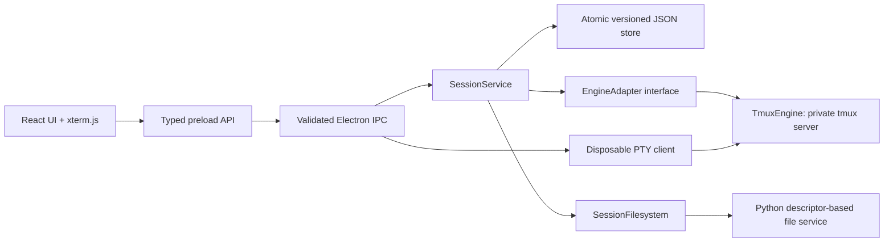

# Architecture

## Responsibility boundaries

Electron supplies the desktop window and native directory chooser. The renderer is sandboxed, context-isolated, has Node integration disabled, and loads only local production assets with a restrictive Content Security Policy. Navigation, new windows, webviews, and permission requests are denied. Every IPC request validates the sender's exact local main-frame URL; payloads are validated before reaching services. The preload exposes named operations, not generic IPC or filesystem primitives. These choices follow [Electron's security guidance](https://www.electronjs.org/docs/latest/tutorial/security) and [context isolation guidance](https://www.electronjs.org/docs/latest/tutorial/context-isolation).

`SessionService` delegates state commits, launches, stops and reconciliation to separate modules. Only JSON mutations share a commit mutex. `Store` validates a versioned schema and saves using a temporary file, fsync, rename, and directory fsync. State is swapped in memory only after a successful disk commit. Launches write their complete batch intent first, then start processes sequentially. If interrupted, each saved ID is either present in tmux or shown missing. Individual launch failures are recorded while the rest of a batch continues. No command is replayed during recovery. Monotonic snapshot sequence numbers let the renderer reject stale responses; polling never overlaps itself. Engine errors return saved session metadata with unknown terminal status. Deletion uses persisted tombstones, idempotent kills, and durable record removal.

`EngineAdapter` is the only process-management interface. A remote engine can implement this contract later without changing the session store or file panel. The local engine exclusively uses tmux argv calls; there is no interpolated management shell command. A launch command is intentionally user-authored Bash code, passed as one argument to interactive login Bash so normal interactive setup and aliases are available. Presets store the same command data. Each terminal has a dedicated tmux session with a UUID name; a logical project session groups any number of them. This avoids sharing tmux's active-window selection across UI tabs. Empty project sessions remain valid.

tmux owns the PTYs and surviving processes. Its private socket and generated configuration isolate the app from a user's tmux settings. `remain-on-exit` is configured before the first terminal starts, preserving even immediately exiting processes. See tmux's [Getting Started](https://github.com/tmux/tmux/wiki/Getting-Started) and [Advanced Use](https://github.com/tmux/tmux/wiki/Advanced-Use) documentation for lifecycle behavior.

Only the selected terminal gets a disposable tmux client. A small Python PTY bridge supports input, Unicode output, full-screen terminal programs, and window resizing without native Node addons or Electron ABI rebuilds. Closing that client disconnects the view; it does not own the underlying work. xterm.js renders terminal escape sequences and handles input using its [terminal API](https://xtermjs.org/docs/api/terminal/classes/terminal/). The renderer acknowledges parsed output, so a fast producer cannot grow the IPC queue without bound. Input uses bounded, sequential acknowledged IPC writes. The Python bridge drains input with nonblocking PTY writes while continuing to read output; it pauses its input pipe when queued data exceeds its high-water mark. Reconnect disposes of only the attachment and retries against the same terminal ID. Inactive terminals generate no renderer traffic, and one tmux inspection reads all process states per refresh. Lazy loading keeps terminal code out of the initial UI bundle.

`SessionFilesystem` runs independently of Electron's main thread. It keeps a descriptor for each session root, validates relative paths, and resolves directory paths with Linux `openat2(RESOLVE_BENEATH | RESOLVE_NO_SYMLINKS | RESOLVE_NO_MAGICLINKS | RESOLVE_NO_XDEV)`. All leaf operations use directory descriptors and no-follow flags. Native `renameat2(RENAME_NOREPLACE)` prevents move races that would overwrite an existing destination. Files with multiple hard links, symlinks, devices, and other special files are blocked from opening. Text writes create and sync a sibling temporary inode before replacing the destination. Root device/inode identity is stored and verified when registering after reopen. Linux kernel 5.6+ is required; there is no insecure fallback if kernel containment is unavailable.

On WSL's Windows filesystem, `RENAME_NOREPLACE` is unavailable. The provider exclusively reserves destinations instead: files use link/unlink, and directories use mkdir/rename. Existing destinations still fail without overwriting their content. The file fallback can leave two names after a crash between link and unlink; they are blocked from editing until the extra link is removed. This tradeoff keeps moves available on the user's Windows projects without silently overwriting files.

Before spawning tmux or a terminal client, Python closes inherited nonstandard descriptors. Electron can otherwise leak private sockets into a detached tmux server, preventing an automation or parent process from observing the GUI's complete shutdown. The desktop close/reopen test exercises this boundary.

The renderer separates the session sidebar/search (`SessionSidebar`), workspace dialogs (`WorkspaceDialog`), command entry (`LaunchDialog`), tabs (`TerminalTabs`), snapshot sequencing (`useWorkspace`), and the attached terminal (`Terminal`). `App.tsx` now coordinates these views in 496 lines, down from 838 before M1. Selected tabs and explorer visibility live in local presentation storage. The existing preset-based launch API delegates to the unified launch operation. Version-1 state migrates to version 2 with a preserved backup. The [versioned control protocol](control-protocol.md) validates the preload handshake, named operations, replies and terminal signals. Committed event hints trigger coalesced snapshot refreshes; polling remains a fallback. The branding/footer use the validated handshake's `app.getVersion()` value rather than a hard-coded release label.

## Future changes

- Layout state belongs in a renderer/domain presentation model. Process identities already exist independently of rendered tabs.
- Remote sessions can add another `EngineAdapter` and filesystem provider, with a transport identifier added in a schema migration.
- Richer file operations belong in the filesystem provider and typed request schema, keeping containment enforcement centralized.
- Collaboration needs an explicit authorization and ownership model at the service boundary; this local v1 has no multi-user transport.
- Changes to persistent structure require an explicit versioned migration. Do not reinterpret old fields or discard invalid data.

## Failure behavior

- GUI exits or crashes: the disposable attachment closes, and tmux keeps work.
- Backend process disappears: saved terminal becomes missing, and no launch is attempted.
- Command completes: retained tmux pane records output and exit code.
- Engine inspection fails: saved sessions and terminals stay visible with unavailable status; the next poll retries.
- File worker stops: pending operations reject. The next operation starts a fresh worker and re-registers roots with their saved identities. Uncertain mutations are not automatically replayed. Work in tmux is unaffected.
- Directory disappears, becomes inaccessible, or is replaced: the file panel reports the failure rather than silently rebinding it.
- Save fails or JSON is corrupt: preserve existing data, report the error, and avoid launching unrecorded processes.

Exit polling can recover a missed tmux child notification: it verifies a zombie pane belongs to the same-user private server and signals that server with SIGCHLD. tmux then records the actual exit status and fires its hook. This is best-effort process accounting, not a synthetic exit code. See the [tmux 3.4 child handler](https://github.com/tmux/tmux/blob/3.4/server.c#L434) for the underlying reap operation.

## M0 runtime and storage decision — 2026-09-13

The application still has the responsibility boundaries above. These experiments select the M1/M2 implementation path; they are not a production runtime or a state migration.

| Decision | Evidence and consequence |
| --- | --- |
| Reuse the packaged Electron executable in Node mode for M1 | The actual 44.2.0 package starts without a display or global Node, reports Node 24.20.0 and SQLite 3.53.4, and passes `npm run test:runtime`. Preserve the `runAsNode` fuse and test the shipped binary on every release. A separate Node distribution adds a second upgrade/attribution surface without a demonstrated need. [Electron fuses](https://www.electronjs.org/docs/latest/tutorial/fuses) |
| Use `node:sqlite` in a bounded worker for M2 | Both the development Node 22.23.2 engine (SQLite 3.51.3) and packaged engine were inspected. The packaged probe recovers committed Unicode rows, rolls back an interrupted transaction and passes integrity checks with WAL/FULL. This fixes neither unsupported filesystem semantics nor application-level migration. The WAL-reset fix is in 3.51.3 and later; test the shipped engine, not the development minimum. [SQLite WAL](https://sqlite.org/wal.html) |
| Acquire a stable OS lock before runtime admission | `helpers/runtime_lock.py` takes nonblocking `flock`, validates the file, closes unrelated descriptors and execs the runtime retaining only the lock. Duplicate ownership fails with code 73. Tests prove that Node children do not inherit it and that SIGKILL releases it without replacing the inode. The desktop creates the per-profile lock inode before spawning the helper; `ControlServer.listen` additionally validates the parent directory ownership/mode, and the authenticated socket transport binds operation scope to the connecting peer. |
| Separate runtime shutdown from terminal execution lifetime | Detached and transient user-service probes both preserve a cold-started tmux job through runtime SIGKILL, restart, reuse and SIGTERM. The service probe uses `KillMode=process`. Default cgroup-wide killing cannot meet this ownership contract. The shipped desktop spawns the runtime as its own process group through `helpers/runtime_lock.py`, so the GUI cannot race tmux work on shutdown; `RuntimeHandle.stop("SIGTERM", …)` drains the runtime before the desktop exits. The deployment test exercises both the lock-inode invariant under SIGKILL and the shared-socket-directory refusal path. This setting is not universal process-tree cleanup or a guarantee against logout/WSL shutdown. No autostart service was installed. |
| Keep provider qualification separate from discovery | `npm run probe:providers` only runs bounded version/help commands in a disposable directory. It reads no login store, sends no prompts and spends no provider quota. Installed versions are Codex 0.154.0 and Claude Code 2.1.268. Its output deliberately marks live invocation, crash recovery and production qualification false. |

Start the M3 adapter trial with Codex `exec --json`: the installed CLI advertises JSONL and explicit resume, matching the documented non-interactive interface. Keep app-server optional while its documentation retains an experimental/production-support caveat. A thin persistent invocation owner is the default for a process with ephemeral stdio; remove it only if a native lifecycle passes durable-output and restart tests. [Codex non-interactive mode](https://learn.chatgpt.com/docs/non-interactive-mode), [app-server](https://learn.chatgpt.com/docs/app-server).

Claude's installed CLI advertises bidirectional stream JSON, explicit resume and background attach/logs/stop operations. Those flags do not prove a lossless structured replay contract. Its print-mode streaming is a viable second adapter candidate. Do not choose `--bare` for subscription users: it changes authentication and configuration discovery. Paid/authenticated canaries, continuation, permission exchanges and native background recovery remain explicit M3/M4 qualification work; no adapter is advertised as working yet. [Programmatic Claude Code](https://code.claude.com/docs/en/headless).

Reproduce with `npm run package`, `npm run test:runtime`, optionally `npm run test:runtime -- --systemd` on a working user service manager, and `npm run probe:providers`. Runtime fixtures use fresh `/tmp/minimal-runtime-spike-*` storage, their own socket, no active profile, and no GUI. This proves the selected binary/driver/lock/lifetime combination; M1 still needs a real control protocol, supervisor, startup reconciliation and integration of existing services.
